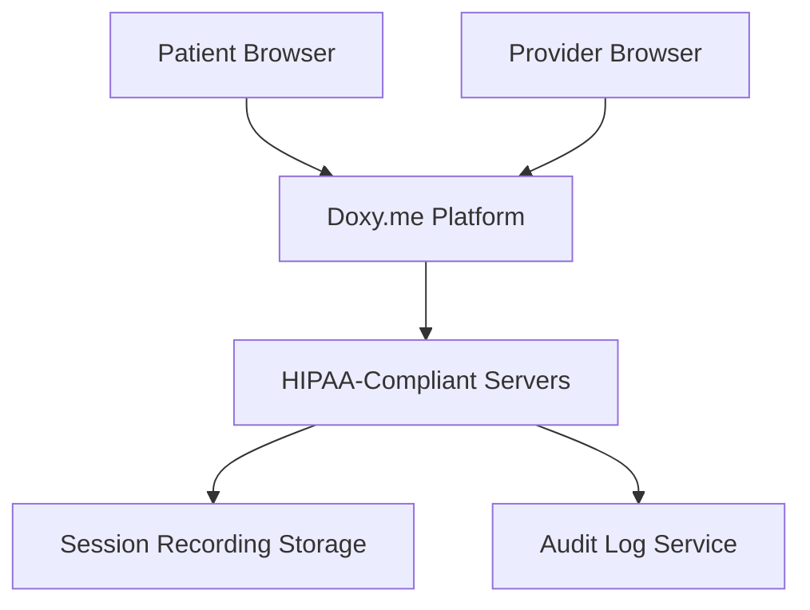

**Category:** Healthcare & Medical Hosting
**Difficulty:** Intermediate
**Reading time:** 6 min read

---

Doxy.me is a HIPAA-compliant, browser-based telemedicine platform designed for healthcare providers of all specialties and practice sizes. It emphasizes simplicity, ease of use, and affordable pricing without compromising on security or clinical functionality, enabling rapid adoption without IT infrastructure needs.

- **Browser-Based Telemedicine** — No app installation required for patients or providers
- **HIPAA Compliance** — Built-in encryption, audit logging, and security infrastructure
- **Waiting Room Feature** — Virtual waiting area with patient intake questionnaires
- **Easy Scheduling Integration** — Connect with calendar systems or use native scheduler
- **No Download Required** — Ultra-simple patient experience improving adoption

Doxy.me operates as a fully cloud-hosted HIPAA-compliant platform built on AWS infrastructure. Providers create a simple web link to share with patients or embed in their practice website. When patients click the link, they enter a waiting room where they can see their position in the queue and complete intake forms. Providers see incoming patient requests and initiate encrypted video sessions directly from the browser. The platform uses WebRTC for low-latency video with fallback to backup servers if primary connection drops. Sessions can be recorded (with consent) and stored in encrypted cloud storage. The waiting room feature captures essential patient information digitally, reducing check-in time. All access is logged with HIPAA-compliant audit trails. Integration with practice management systems or calendar apps enables automated appointment handling.

- Solo practitioners and small practices needing simple telemedicine without complexity
- Mental health and telepsychiatry services with high privacy requirements
- Urgent care and occupational health services supplementing in-person visits
- Specialty consultations reducing patient travel
- International healthcare providers serving distributed patient bases
- Practices wanting low-cost telemedicine without enterprise EHR commitment

| Advantage | Disadvantage |
|-----------|--------------|
| Extremely simple, minimal training required | Lacks integration with EHR for automatic note-taking |
| No app download required improves patient adoption | Limited customization for branded experiences |
| Affordable per-provider pricing | Smaller ecosystem of third-party integrations |
| Built for telemedicine (not feature bloat) | Recording storage adds per-visit costs |
| Browser-based works on any device | Less robust reporting than enterprise platforms |

- [Telemedicine platform hosting](telemedicine-platform-hosting.md)
- [Patient portal hosting](patient-portal-hosting.md)
- [Healthcare compliance monitoring](healthcare-compliance-monitoring.md)

---
*Part of the [Healthcare & Medical Hosting](healthcare-medical-hosting/index.md) category · [Back to Master Index](../../index.md)*