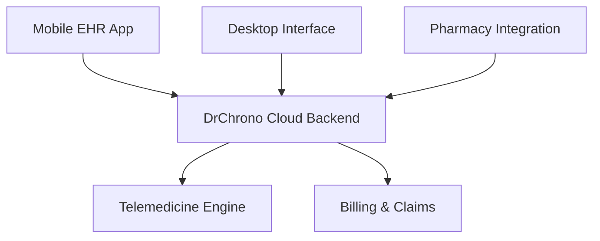

**Category:** Healthcare & Medical Hosting
**Difficulty:** Intermediate
**Reading time:** 6 min read

---

DrChrono is a cloud-based EHR and practice management platform optimized for independent and small practices, offering mobile-first workflows, telemedicine integration, and transparent, usage-based pricing. It emphasizes ease of use and integration with existing healthcare infrastructure.

- **Mobile-First EHR** — Native iOS and Android apps for providers to document on-the-go
- **Telemedicine Built-In** — Video consultation capability integrated with clinical workflows
- **Cloud Practice Management** — Scheduling, billing, and patient management unified
- **Prescription Management** — E-prescribing integration with pharmacy networks
- **Transparent API** — RESTful endpoints for custom integrations and health IT ecosystem connections

DrChrono hosts its platform on AWS infrastructure with HIPAA compliance, encryption at rest and in transit, and regular security audits. The mobile app allows providers to document patient visits using structured templates, which automatically feed into billing workflows. The telemedicine component handles video conferencing with built-in HIPAA compliance and automatic clinical note creation post-visit. The practice management module handles scheduling, insurance verification, and patient check-in. Billing workflows are automated with EDI submission to payers. The platform offers a comprehensive REST API enabling integrations with labs, imaging centers, and EHR partners. Patient portal features include messaging, appointment booking, and records access.

- Solo practitioners and small practices needing mobile-first EHR
- Practices implementing or expanding telemedicine programs
- Independent clinicians wanting HIPAA-compliant video consultation capability
- Clinics seeking modern mobile workflow without legacy system complexity
- Specialty practices needing portable EHR during patient visits
- Urgent care and primary care clinics with high patient volume

| Advantage | Disadvantage |
|-----------|--------------|
| True mobile-first design enables efficient workflows | Less robust than enterprise EHRs for complex practices |
| Telemedicine deeply integrated reduces context switching | Reporting features less extensive than PM-focused platforms |
| Usage-based pricing fair for small practices | API ecosystem smaller than major EHR vendors |
| Fast implementation with cloud-only approach | Customization options limited |
| Strong focus on provider experience and ease-of-use | May lack specialty-specific templates |

- [Telemedicine platform hosting](telemedicine-platform-hosting.md)
- [E-prescribing (EPCS) hosting](e-prescribing-epcs-hosting.md)
- [Patient portal hosting](patient-portal-hosting.md)

---
*Part of the [Healthcare & Medical Hosting](healthcare-medical-hosting/index.md) category · [Back to Master Index](../../index.md)*