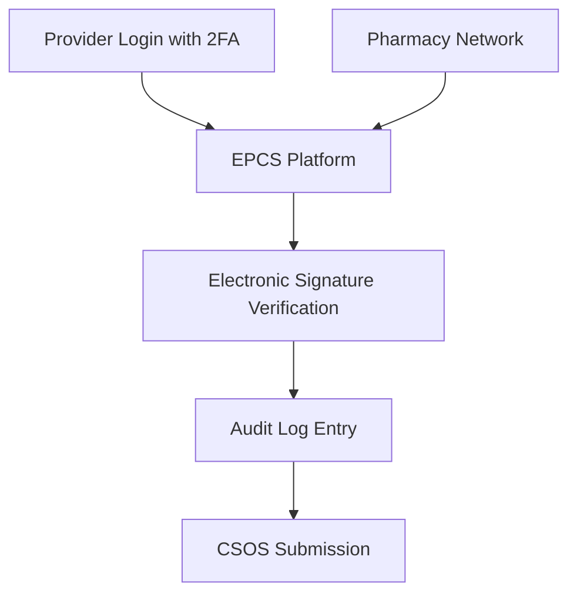

**Category:** Healthcare & Medical Hosting
**Difficulty:** Intermediate
**Reading time:** 6 min read

---

E-Prescribing with Electronic Prescriptions for Controlled Substances (EPCS) provides cloud-based infrastructure for securely prescribing all medications including controlled substances. EPCS platforms comply with DEA regulations for electronic signature, audit trails, and secure transmission of controlled substance prescriptions.

- **Electronic Signature** — DEA-compliant digital signing of controlled substance prescriptions
- **Two-Factor Authentication** — Enhanced security for EPCS prescriber access
- **Audit Trails** — Complete logging of prescription creation, modification, and transmission
- **CSOS Reporting** — Integration with state Controlled Substance Order Systems
- **Emergency Situations** — Paper backup protocols when electronic systems unavailable

EPCS platforms operate on HIPAA and DEA-compliant cloud infrastructure with enhanced security measures. Prescribers authenticate using two-factor authentication (biometric, hardware token, or SMS) and electronic signature mechanisms. Clinical decision support validates prescriptions for appropriateness, checking for controlled substance red flags and patient risk factors. When a prescriber submits an EPCS prescription, the platform creates an audit trail documenting time, prescriber identity, medication, dosage, and indication. Electronic signatures are applied per DEA specifications using digital certificates. The prescription is submitted to state CSOS systems to track dispensing and identify drug-seeking patterns. Transmission to pharmacies occurs via secure NCPDP channels. Emergency paper backup procedures comply with DEA requirements for situations when electronic systems are unavailable.

- Practices prescribing opioids requiring DEA compliance and monitoring
- Addiction treatment programs managing controlled substance therapy
- Pain management clinics handling complex controlled substance prescribing
- Psychiatry practices prescribing controlled substances for ADHD/anxiety
- Healthcare systems wanting unified controlled substance governance
- Prescribers seeking to reduce drug diversion and abuse

| Advantage | Disadvantage |
|-----------|--------------|
| DEA compliance eliminates prescriber liability | Two-factor authentication adds friction to workflow |
| CSOS integration enables drug diversion prevention | Regulatory complexity requires specialized knowledge |
| Audit trails support regulatory investigations | Technical failures require emergency paper procedures |
| Electronic signature meets DEA requirements | Limited flexibility in signature mechanisms |
| Integrated with pharmacy networks for efficiency | State CSOS systems vary in integration maturity |

- [Prescription management systems](prescription-management-systems.md)
- [Pharmacy management systems](pharmacy-management-systems.md)
- [Healthcare compliance monitoring](healthcare-compliance-monitoring.md)

---
*Part of the [Healthcare & Medical Hosting](healthcare-medical-hosting/index.md) category · [Back to Master Index](../../index.md)*