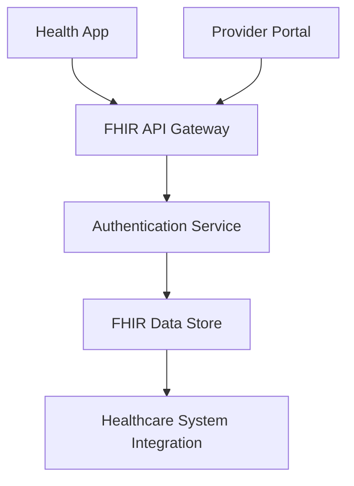

**Category:** Healthcare & Medical Hosting
**Difficulty:** Intermediate
**Reading time:** 6 min read

---

FHIR (Fast Healthcare Interoperability Resources) API hosting provides cloud-based REST API services enabling standardized, modern access to healthcare data. FHIR-compliant APIs allow developers to build interoperable healthcare applications that can exchange patient data seamlessly across systems.

- **RESTful API Design** — Standard HTTP methods and JSON/XML payloads for healthcare data access
- **FHIR Resources** — Standardized data models for patients, medications, observations, encounters, etc.
- **Security & Authentication** — OAuth 2.0 and SMART on FHIR for secure application authentication
- **Scalability** — Cloud infrastructure handling millions of API requests from diverse applications
- **Interoperability** — Standards-based approach enabling data exchange across healthcare ecosystems

FHIR API platforms host on cloud infrastructure providing REST endpoints for healthcare data access. Applications authenticate using OAuth 2.0 or SMART on FHIR protocols, requesting scopes appropriate for patient consent. The API gateway validates requests, applies authorization rules ensuring applications access only allowed data, and routes requests to backend services. Data is returned in FHIR-compliant JSON or XML format with standardized structure. Write operations (creating prescriptions, recording observations) follow FHIR specifications and integrate with EHR systems. The platform provides comprehensive API documentation, sandbox environments for testing, and versioning support for backward compatibility. Rate limiting and throttling protect infrastructure from abuse. Audit logs track all API access for compliance with HIPAA and security monitoring.

- Third-party health app developers building patient-facing applications
- Care coordination platforms integrating data from multiple EHR vendors
- Research datasets providing de-identified FHIR data to researchers
- Health information exchanges enabling interoperability between hospitals
- Telehealth platforms accessing patient history and orders
- Population health analytics aggregating data across multiple systems

| Advantage | Disadvantage |
|-----------|--------------|
| Modern REST API design aligns with developer expectations | Widespread adoption still developing compared to HL7 |
| FHIR resources standardize data models across vendors | Customization and complex healthcare workflows challenging |
| OAuth 2.0 enables secure third-party app development | Fragmented FHIR adoption creates implementation variance |
| Supports both read and write operations | Security model complexity requires expertise |
| Excellent foundation for modern health IT ecosystems | Performance at large scale still evolving |

- [HL7 interface hosting](hl7-interface-hosting.md)
- [Healthcare interoperability platforms](healthcare-interoperability-platforms.md)
- [Healthcare analytics platforms](healthcare-analytics-platforms.md)

---
*Part of the [Healthcare & Medical Hosting](healthcare-medical-hosting/index.md) category · [Back to Master Index](../../index.md)*