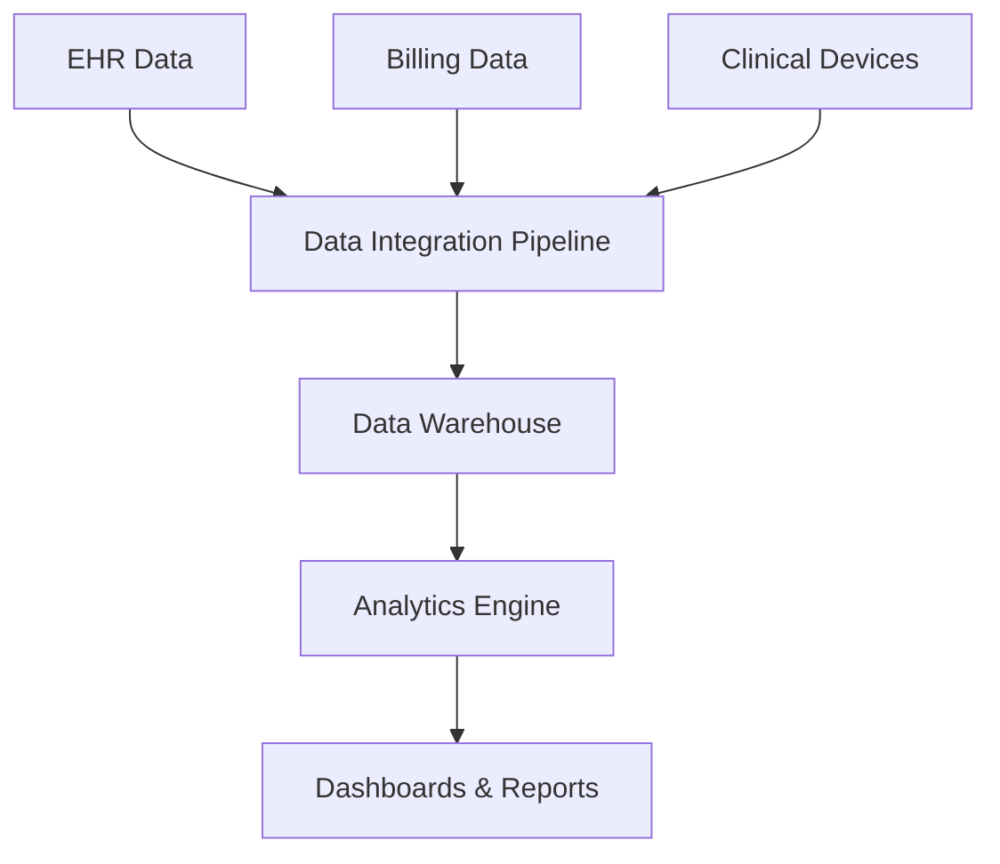

**Category:** Healthcare & Medical Hosting
**Difficulty:** Intermediate
**Reading time:** 6 min read

---

Healthcare analytics platforms provide cloud-based data warehousing and business intelligence infrastructure for analyzing clinical and operational healthcare data. These platforms aggregate data from EHRs, billing systems, and clinical devices to enable data-driven decision-making, quality improvement, and population health management.

- **Data Integration** — ETL processes combining data from multiple healthcare systems
- **Clinical Analytics** — Analysis of clinical outcomes, quality metrics, and care patterns
- **Financial Analytics** — Revenue cycle analysis, cost allocation, and financial forecasting
- **Dashboards & Reporting** — Interactive visualization of key performance indicators
- **Predictive Analytics** — Machine learning models for patient risk stratification

Healthcare analytics platforms operate on cloud data warehouses (Snowflake, Redshift, BigQuery) with HIPAA-compliant infrastructure. Data from multiple clinical, financial, and operational systems is extracted via APIs or database connections, transformed into common data models, and loaded into the warehouse. Data quality processes validate completeness and accuracy. Clinical analytics calculate quality metrics (readmission rates, infection rates, length of stay) at patient, provider, and system levels. Financial analytics track revenue cycle metrics, cost per case, and payer mix. Dashboards provide real-time visibility into operational metrics. Predictive models identify patients at high risk for readmission, sepsis, or deterioration. Governance controls ensure data security and appropriate access controls. De-identification processes support research and analytics while protecting patient privacy.

- Health systems analyzing quality metrics and care outcomes
- Hospital efficiency improvement identifying bottlenecks and best practices
- Population health management identifying high-risk patients for intervention
- Research institutions analyzing clinical outcomes and epidemiology
- Payers analyzing claims data for fraud detection and care management
- Practices benchmarking performance against peers

| Advantage | Disadvantage |
|-----------|--------------|
| Aggregates data from multiple systems for holistic view | Complex data integration and transformation required |
| Enables predictive analytics for proactive interventions | Significant upfront investment and ongoing maintenance |
| Dashboards drive data-informed decision-making | Data quality issues impact accuracy of analytics |
| Supports regulatory and accreditation reporting | Privacy and de-identification complexity |
| Scales to enterprise data volumes efficiently | Specialized skills needed for analytics team |

- [Population health management](population-health-management.md)
- [Clinical decision support systems](clinical-decision-support-systems.md)
- [Healthcare compliance monitoring](healthcare-compliance-monitoring.md)

---
*Part of the [Healthcare & Medical Hosting](healthcare-medical-hosting/index.md) category · [Back to Master Index](../../index.md)*