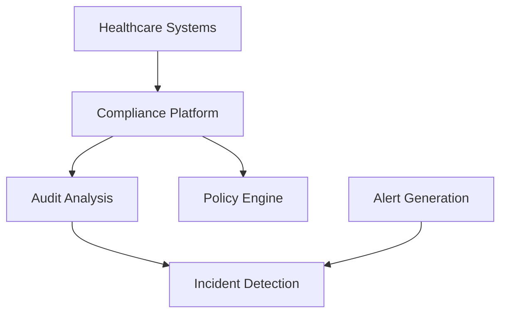

**Category:** Healthcare & Medical Hosting
**Difficulty:** Intermediate
**Reading time:** 6 min read

---

Healthcare compliance monitoring platforms provide cloud-based infrastructure for tracking adherence to healthcare regulations. These systems automate monitoring, provide audit trails, and enable rapid response to compliance violations.

- **Audit Logging** — Comprehensive logging of system access and data interactions
- **Policy Enforcement** — Automated enforcement of organizational security and privacy policies
- **Vulnerability Scanning** — Regular assessment of system security posture
- **Incident Tracking** — Documentation and investigation of security and privacy incidents
- **Reporting** — Compliance reports for regulators and accreditors

Healthcare compliance platforms aggregate logs from healthcare systems into centralized monitoring infrastructure. Policy enforcement engines block actions violating organizational policies. Vulnerability scanners assess systems for security weaknesses. Incident detection identifies suspicious activities. Automated workflows engage incident response teams. Investigation tools enable forensic analysis. Compliance reports generate documentation for audits.

- Large health systems meeting HIPAA compliance
- Covered entities responding to investigations
- Cloud providers offering healthcare infrastructure
- Healthcare systems supporting breach notification
- Practices managing audit readiness
- Payers meeting regulatory requirements

| Advantage | Disadvantage |
|-----------|--------------|
| Comprehensive audit logging for forensics | Alert fatigue from excessive notifications |
| Automated incident detection enables response | Requires skilled security personnel |
| Policy enforcement prevents violations | False positives interfere with workflows |
| Regulatory reports demonstrate due diligence | Significant operational overhead |
| Improves breach response timeline | Integration complexity with systems |

- [Healthcare data backup and recovery](healthcare-data-backup-and-recovery.md)
- [Audit log retention for healthcare](audit-log-retention-for-healthcare.md)
- [Healthcare disaster recovery](healthcare-disaster-recovery.md)

---
*Part of the [Healthcare & Medical Hosting](healthcare-medical-hosting/index.md) category · [Back to Master Index](../../index.md)*
