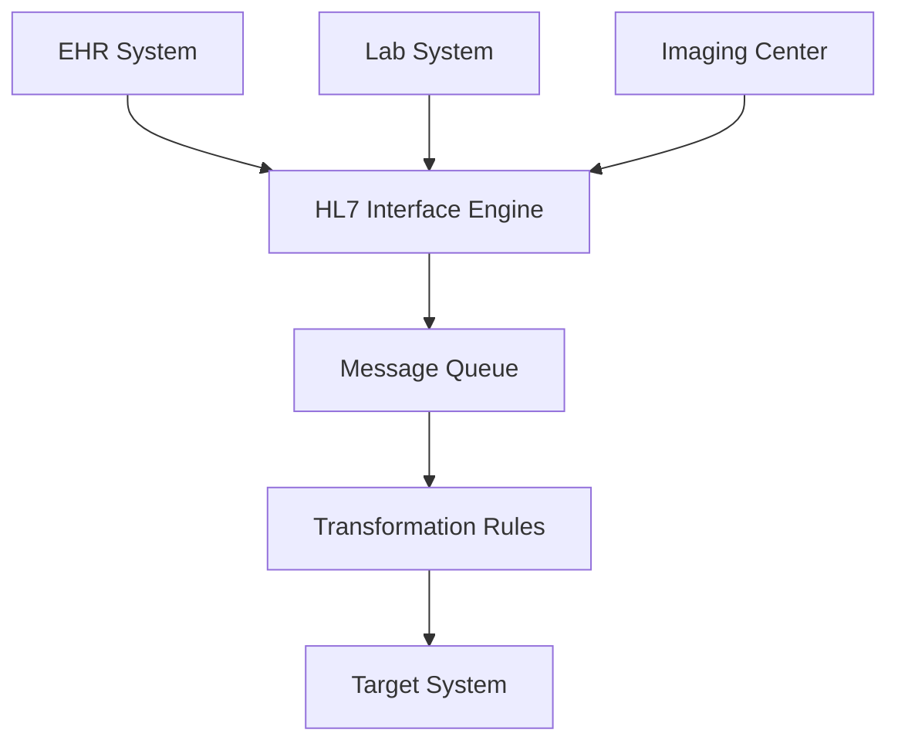

**Category:** Healthcare & Medical Hosting
**Difficulty:** Intermediate
**Reading time:** 6 min read

---

HL7 (Health Level 7) interface hosting provides cloud-based infrastructure for integrating healthcare systems through standardized message exchange. These platforms enable secure, reliable communication between EHRs, practice management systems, labs, imaging centers, and other healthcare applications using HL7 v2 and v3 protocols.

- **HL7 Message Routing** — Intelligent message transformation and routing between healthcare systems
- **Message Translation** — Conversion between HL7 versions and healthcare data formats
- **Error Handling** — Automatic retry, queuing, and exception management for failed messages
- **Audit & Compliance** — Complete logging of all message exchanges for HIPAA documentation
- **Real-time Processing** — Synchronous and asynchronous message handling at healthcare scale

HL7 interface platforms operate on cloud infrastructure with HIPAA-compliant messaging, encryption at rest and in transit, and robust error handling. Systems connect to healthcare applications via standard HL7 TCP/IP protocols or HTTPS-based REST APIs. Incoming messages are validated against HL7 schema, parsed, and queued for processing. Transformation rules apply mappings between different system formats, extracting relevant fields and reformatting for target systems. Messages are routed to appropriate destinations based on message type and content. Error handling includes automatic retry with exponential backoff, manual intervention queues for failed messages, and alerting for critical failures. All message exchanges are logged with complete audit trails including source, destination, content hash, and processing status. Integration with monitoring systems enables real-time visibility into message flow and performance metrics.

- Hospital integrating results from reference labs with EHR
- Health system synchronizing patient data across multiple practice locations
- Imaging centers transmitting DICOM images and structured reports
- Pharmacy systems receiving e-prescriptions and sending refill requests
- Public health agencies receiving reportable disease notifications
- Insurance integration for eligibility verification and claims submission

| Advantage | Disadvantage |
|-----------|--------------|
| Standardized HL7 enables broad system integration | HL7 is aging standard with v2 limitations |
| Cloud platform eliminates custom middleware infrastructure | Implementation requires HL7 expertise |
| Error handling ensures message delivery reliability | Message mapping complexity grows with system count |
| Complete audit trails support compliance requirements | Latency requirements may challenge cloud deployment |
| Scales easily as interface volumes grow | Vendor-specific extensions complicate interoperability |

- [FHIR API hosting](fhir-api-hosting.md)
- [Healthcare interoperability platforms](healthcare-interoperability-platforms.md)
- [Healthcare compliance monitoring](healthcare-compliance-monitoring.md)

---
*Part of the [Healthcare & Medical Hosting](healthcare-medical-hosting/index.md) category · [Back to Master Index](../../index.md)*