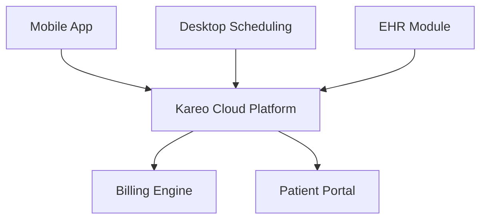

**Category:** Healthcare & Medical Hosting
**Difficulty:** Intermediate
**Reading time:** 6 min read

---

Kareo is a cloud-based practice management and EHR platform specifically designed for small and mid-sized independent medical practices and specialty clinics. It offers simplified workflows, transparent pricing, and strong patient engagement features with minimal implementation overhead.

- **Simple Scheduling** — Intuitive appointment booking with minimal training required
- **Cloud EHR** — Lightweight electronic records focused on essential clinical data
- **Patient Engagement Platform** — Online portals, SMS reminders, and patient messaging
- **Revenue Intelligence** — Clear visibility into billing metrics and cash flow
- **Mobile Access** — Apps for providers and staff to access schedules and records remotely

Kareo operates as a simplified, cloud-native practice management solution with transparent, per-provider monthly pricing. The platform eliminates legacy complexity by focusing on essential workflows: scheduling, basic clinical documentation, and straightforward billing. Mobile and web interfaces ensure staff can access the system from any device. The patient portal integrates with SMS messaging, enabling automated appointment reminders, follow-up surveys, and secure messaging with providers. Billing is automated with EDI submission to major payers. Data is encrypted in transit and at rest, with HIPAA audit logging and compliance monitoring built-in. The platform offers integrations with popular lab providers and EHR ecosystems via standard APIs.

- Solo practitioners and small practices wanting simplified PM/EHR
- Specialty practices focused on operations rather than IT complexity
- Practices looking for straightforward, predictable monthly costs
- Clinics needing strong patient engagement and online scheduling
- Multi-location small practices wanting unified management interface
- Practices seeking minimal implementation timeline and rapid ROI

| Advantage | Disadvantage |
|-----------|--------------|
| Simple, intuitive interface requires minimal training | Limited customization for complex workflows |
| Transparent monthly pricing with no surprise fees | Less advanced reporting than enterprise platforms |
| Fast implementation and go-live | Smaller ecosystem of third-party integrations |
| Strong patient engagement features | May outgrow platform if practice expands significantly |
| Mobile-first design for modern workflows | Limited specialty templates compared to alternatives |

- [Patient portal hosting](patient-portal-hosting.md)
- [Medical billing system hosting](medical-billing-system-hosting.md)
- [FHIR API hosting](fhir-api-hosting.md)

---
*Part of the [Healthcare & Medical Hosting](healthcare-medical-hosting/index.md) category · [Back to Master Index](../../index.md)*