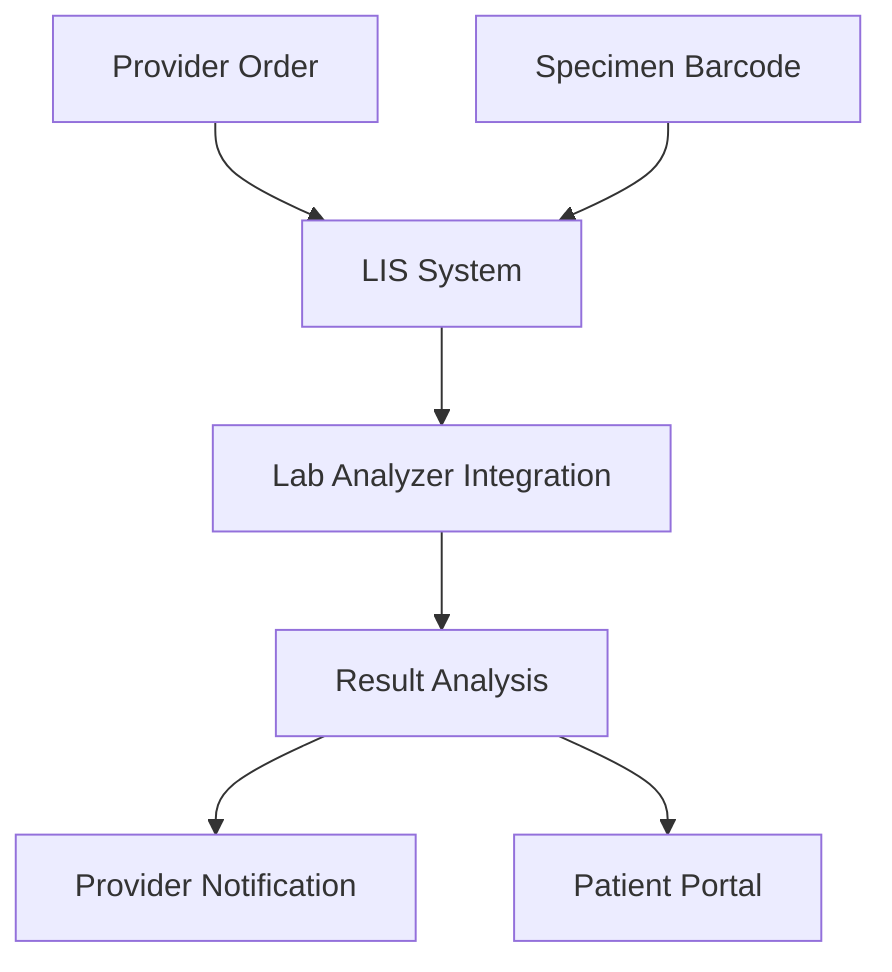

**Category:** Healthcare & Medical Hosting
**Difficulty:** Intermediate
**Reading time:** 6 min read

---

Laboratory Information Systems (LIS) provide cloud-based platforms for managing laboratory operations including specimen receipt, test ordering, result analysis, and reporting. LIS platforms automate workflow from order entry through result delivery to clinicians and patients.

- **Order Management** — Receipt and tracking of test orders from providers
- **Specimen Tracking** — Barcode-based tracking from collection through analysis
- **Instrument Integration** — Connection to laboratory analyzers for automated result capture
- **QA/QC Management** — Quality assurance and quality control testing workflows
- **Result Reporting** — Secure delivery of results to providers and patient portals

Laboratory Information Systems host on HIPAA-compliant cloud infrastructure with integration to laboratory analyzers and provider order systems. Orders arrive from providers via EHR systems or standalone order interfaces. Each specimen is assigned a barcode upon collection, enabling tracking throughout the laboratory workflow. The system routes specimens to appropriate analyzers based on test type. Instrument interfaces automatically capture results, eliminating manual data entry. Quality assurance workflows validate results against expected ranges and historical patient data, flagging outliers for review. Results are interpreted by laboratory directors and released for provider notification. Clinical decision support alerts providers to critical values requiring immediate action. Results are delivered securely to provider systems and patient portals. Compliance reporting includes quality metrics, turnaround time analysis, and regulatory documentation.

- Hospital central laboratory processing thousands of tests daily
- Reference laboratories serving multiple provider organizations
- Point-of-care testing networks distributed across health systems
- Specialty laboratories (toxicology, genetics, etc.) with specialized workflows
- Telemedicine laboratories supporting remote specimen collection
- Mobile health initiatives with field collection and centralized testing

| Advantage | Disadvantage |
|-----------|--------------|
| Automation reduces manual entry and transcription errors | Integration with diverse analyzers challenging |
| Barcode tracking prevents specimen misidentification | High upfront investment in instrument integration |
| Real-time result availability improves patient care | Regulatory requirements complex and evolving |
| Quality assurance workflows prevent erroneous results | Limited customization for specialty workflows |
| Critical value alerting ensures timely clinician notification | Turnaround time dependent on analyzer integration |

- [Radiology information system (RIS)](radiology-information-system-ris.md)
- [Medical device data integration](medical-device-data-integration.md)
- [Healthcare analytics platforms](healthcare-analytics-platforms.md)

---
*Part of the [Healthcare & Medical Hosting](healthcare-medical-hosting/index.md) category · [Back to Master Index](../../index.md)*