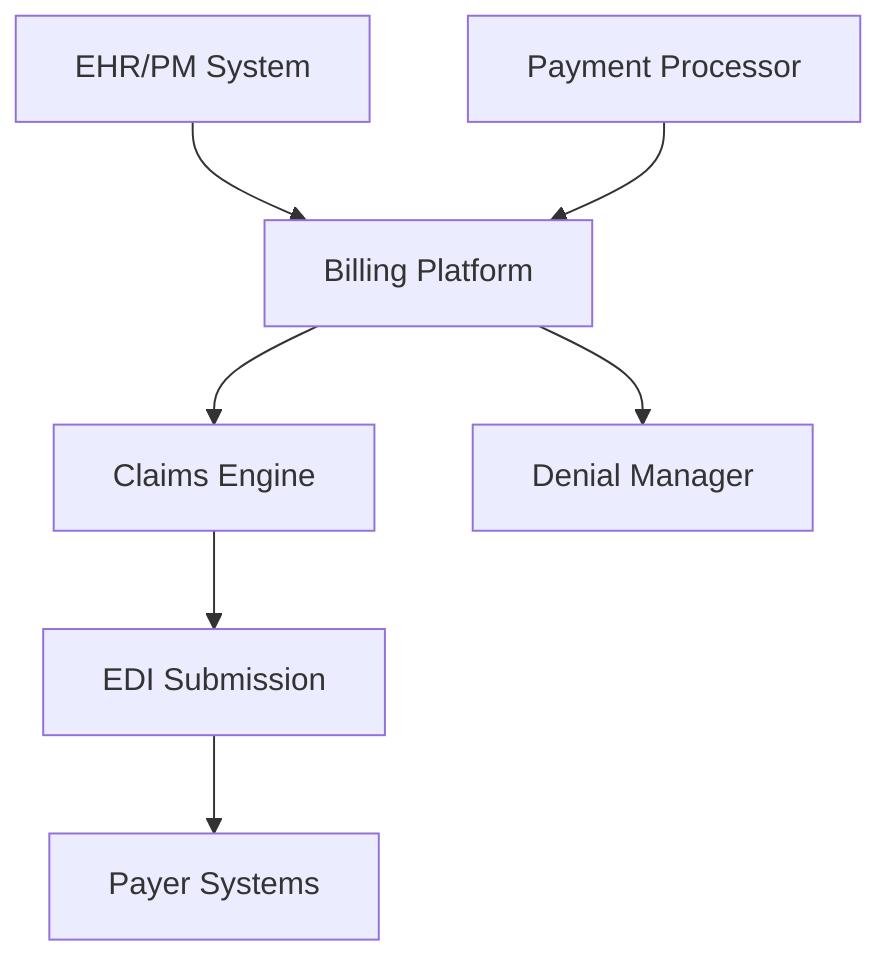

**Category:** Healthcare & Medical Hosting
**Difficulty:** Intermediate
**Reading time:** 6 min read

---

Medical billing system hosting provides cloud-based platforms for managing healthcare revenue cycles, including claims submission, payment processing, denial management, and billing analytics. These systems automate complex billing workflows while ensuring compliance with healthcare regulations and maximizing revenue capture.

- **Claims Management** — Electronic submission to payers with EDI 837 format compliance
- **Denial Management** — Automated tracking, analysis, and resubmission of rejected claims
- **Payment Processing** — Integration with bank systems for automated payment reconciliation
- **Compliance Tracking** — Adherence to HIPAA, CMS rules, and state insurance regulations
- **Revenue Analytics** — Dashboards showing key metrics like Days in A/R, claim approval rates

Medical billing platforms host on secure cloud infrastructure with HIPAA compliance, encryption, and redundancy across multiple availability zones. Clinical and demographic data from EHR and practice management systems feed into the billing engine. The system applies healthcare coding rules (ICD-10, CPT, HCPCS) and generates claims in standard EDI 837 format. Claims are submitted electronically to insurance payers via clearinghouses. The system tracks claim status, routes denials to appropriate staff for investigation and resubmission, and applies payment posting rules. Integration with bank systems enables automated payment receipt and reconciliation. Analytics dashboards provide visibility into revenue cycle metrics, enabling identification of bottlenecks and optimization opportunities. Compliance monitoring ensures coding accuracy and adherence to billing regulations.

- Medical practices seeking to reduce administrative billing overhead
- Health systems managing complex multi-specialty billing workflows
- Practices improving cash flow through denial prevention
- Compliance-intensive practices requiring audit trails and documentation
- Multi-location practices needing centralized billing management
- Specialty practices with complex coding and compliance requirements

| Advantage | Disadvantage |
|-----------|--------------|
| Automation reduces billing staff burden and errors | Requires integration with multiple legacy systems |
| Cloud-based means automatic updates to billing rules | Specialized expertise needed for coding accuracy |
| Faster cash flow through denial prevention | Initial implementation time can be significant |
| Comprehensive compliance documentation for audits | Ongoing support and rule updates necessary |
| Transparent pricing for healthcare services | Customization limited to vendor's platform capabilities |

- [AdvancedMD practice management](advancedmd-practice-management.md)
- [HL7 interface hosting](hl7-interface-hosting.md)
- [Medical billing system hosting](medical-billing-system-hosting.md)

---
*Part of the [Healthcare & Medical Hosting](healthcare-medical-hosting/index.md) category · [Back to Master Index](../../index.md)*