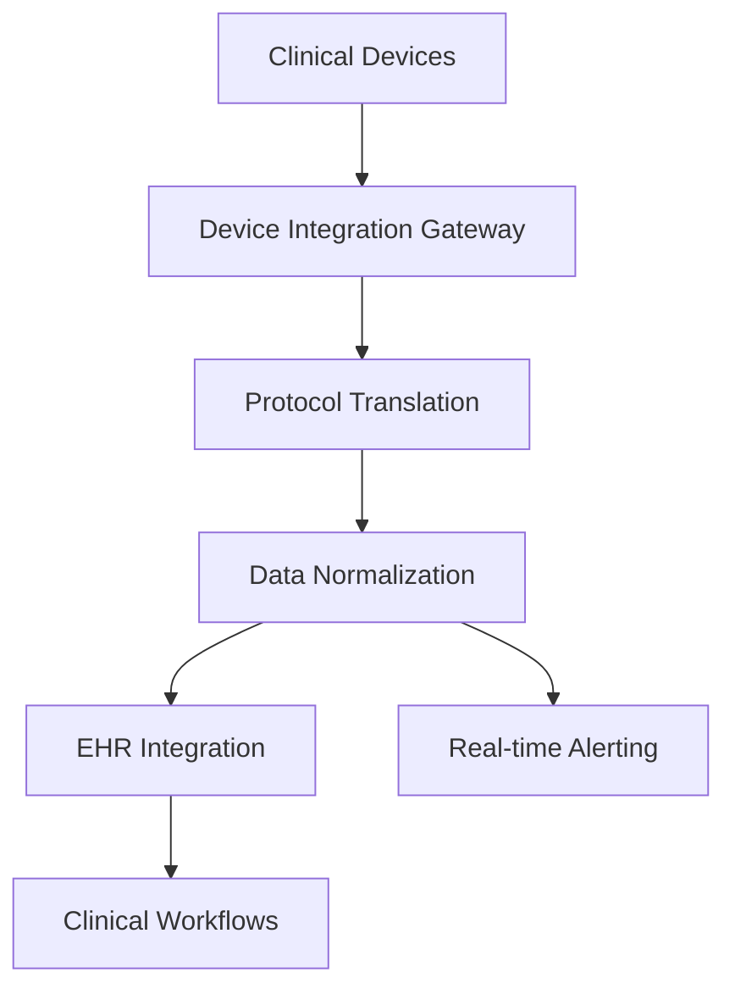

**Category:** Healthcare & Medical Hosting
**Difficulty:** Intermediate
**Reading time:** 6 min read

---

Medical device data integration platforms provide cloud-based infrastructure for aggregating data from clinical devices (monitors, ventilators, infusion pumps, etc.) and integrating it into EHRs and clinical workflows. These systems enable real-time monitoring of patient vital signs and device status.

- **Device Connectivity** — Integration with diverse medical devices via standard and proprietary protocols
- **Real-Time Data Streaming** — Continuous capture of vital signs and device parameters
- **Data Normalization** — Conversion of device-specific formats to standard clinical data models
- **Alert Integration** — Device alerts and alarms integrated into clinical alerting systems
- **Historical Data** — Storage and retrieval of device data for clinical review and analysis

Medical device integration platforms operate on HIPAA-compliant cloud infrastructure with connectivity to bedside monitors, ventilators, infusion pumps, and other clinical devices. Integration methods vary by device: some use standard protocols (HL7, DICOM, IEEE 11073), while others require proprietary connectors developed by device manufacturers. Data from devices is transmitted via secure channels (VPN, TLS encryption) to cloud gateways. Data normalization processes convert device-specific formats and units to standardized clinical data models. Real-time streaming delivers vital signs to clinical dashboards and EHRs. Algorithms detect abnormal values or device issues and trigger alerts to nursing staff. Historical data is stored in HIPAA-compliant databases for retrospective analysis and clinical documentation. Integration with electronic health records enables seamless incorporation into clinical notes and provider workflow.

- ICU environments requiring continuous patient monitoring
- Operating rooms integrating anesthesia records with surgical procedures
- Emergency departments tracking trauma patient vital signs in real-time
- Acute care units managing complex patients with multiple devices
- Tele-ICU programs monitoring patients remotely
- Cardiac monitoring programs detecting arrhythmias

| Advantage | Disadvantage |
|-----------|--------------|
| Real-time monitoring enables rapid response to deterioration | Device integration complex with heterogeneous equipment |
| Automatic data capture reduces manual entry errors | Vendor-specific proprietary protocols limit interoperability |
| Historical device data provides clinical context | Reliability dependent on network and device connectivity |
| Reduces nursing time on manual vital sign documentation | Data validation and quality assurance required |
| Integrates with alert systems for situational awareness | Learning curve for clinical staff on new data availability |

- [Remote patient monitoring platforms](remote-patient-monitoring-platforms.md)
- [Laboratory information system (LIS)](laboratory-information-system-lis.md)
- [Healthcare analytics platforms](healthcare-analytics-platforms.md)

---
*Part of the [Healthcare & Medical Hosting](healthcare-medical-hosting/index.md) category · [Back to Master Index](../../index.md)*