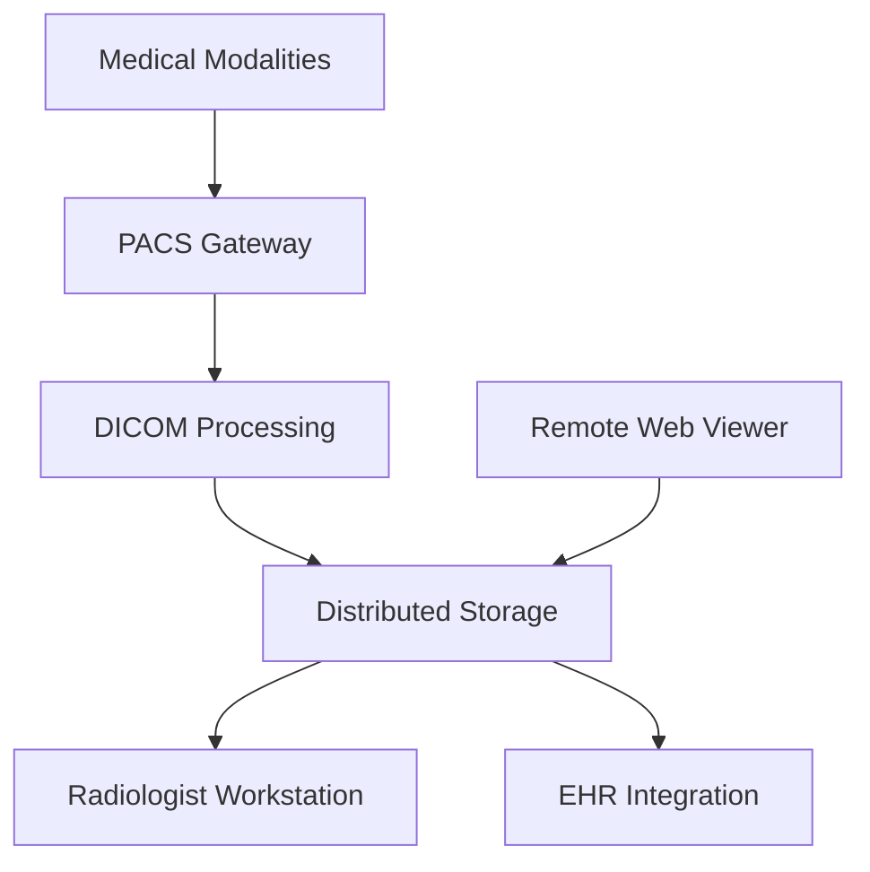

**Category:** Healthcare & Medical Hosting
**Difficulty:** Intermediate
**Reading time:** 6 min read

---

Picture Archiving and Communication System (PACS) hosting provides cloud-based infrastructure for storing, retrieving, and distributing medical imaging studies. These platforms handle massive image datasets, provide radiologist workstations, enable remote consultation, and integrate with EHR systems while maintaining HIPAA compliance and high availability.

- **Image Storage at Scale** — Redundant, geo-distributed storage for petabytes of imaging data
- **Radiologist Workstations** — Specialized viewing software with diagnostic tools and annotations
- **Archive & Retrieval** — Fast access to historical studies and intelligent tiering for cost optimization
- **Remote Access** — Secure web-based viewing enabling off-site consultation
- **Integration** — Connection to modalities (CT, MRI, X-ray), HIS/EHR, and reporting systems

PACS hosting platforms run on cloud infrastructure with distributed storage across multiple availability zones for redundancy. Medical imaging modalities (CT, MRI, X-ray, ultrasound, etc.) send images in DICOM format to a central ingestion point. The PACS system processes incoming studies, applies image compression algorithms, and distributes copies across storage tiers. Hot storage keeps recent studies accessible for rapid retrieval. Cold storage archives older studies with longer access times but lower costs. Radiologist workstations provide specialized viewers with measurement tools, 3D rendering, comparison utilities, and annotation capabilities. Web-based remote viewers enable secure access from any location for consultation or follow-up review. Integration with HIS/EHR systems enables automatic study routing based on clinical context and provider availability. Backup and disaster recovery ensure no loss of imaging data.

- Hospital radiology departments managing thousands of studies daily
- Multi-hospital health systems with centralized radiology services
- Telemedicine radiology enabling 24/7 coverage and subspecialty consultation
- Specialty imaging centers (orthopedic, cardiac, etc.) requiring specialized analysis
- Remote locations accessing specialist radiologists via cloud-based interpretation
- Hybrid cloud deployments combining on-premise and cloud storage

| Advantage | Disadvantage |
|-----------|--------------|
| Eliminates on-premise infrastructure and IT burden | Significant bandwidth requirements for upload/download |
| Geo-distributed redundancy ensures high availability | Migration of large existing datasets is time-consuming |
| Storage tiering optimizes costs for large datasets | Regulatory requirements may limit data residency options |
| Remote access enables radiologist mobility and global teams | Specialized diagnostic workstations less advanced than desktop |
| Automatic backup and disaster recovery built-in | Internet latency can impact interactive diagnostic work |

- [DICOM image storage](dicom-image-storage.md)
- [Healthcare data backup and recovery](healthcare-data-backup-and-recovery.md)
- [Healthcare disaster recovery](healthcare-disaster-recovery.md)

---
*Part of the [Healthcare & Medical Hosting](healthcare-medical-hosting/index.md) category · [Back to Master Index](../../index.md)*