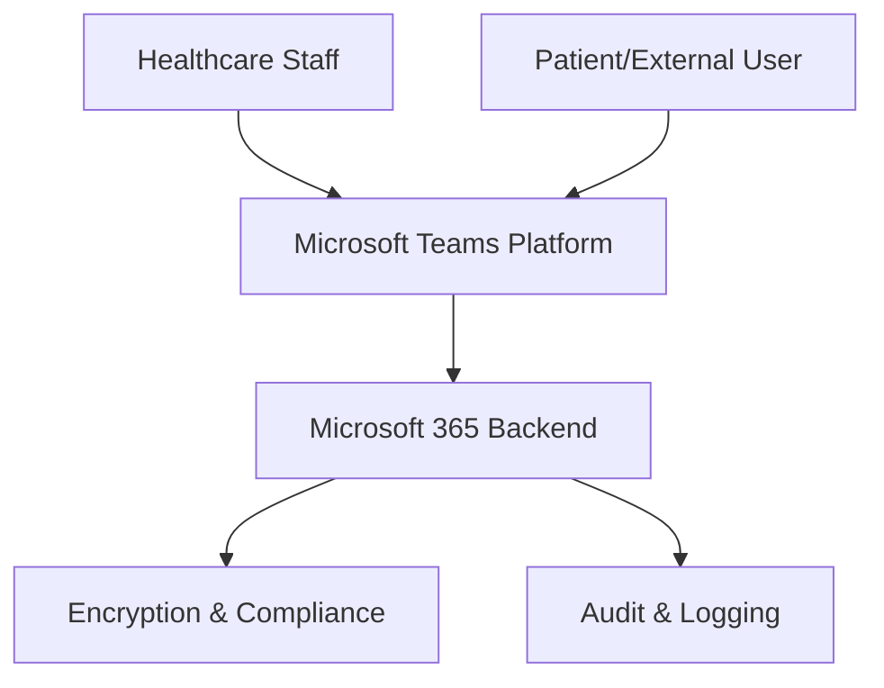

**Category:** Healthcare & Medical Hosting
**Difficulty:** Intermediate
**Reading time:** 6 min read

---

Microsoft Teams for Healthcare is an enterprise collaboration platform designed for healthcare organizations with HIPAA-compliant communication, integrated clinical workflows, and strong administrative governance. It provides messaging, video conferencing, file sharing, and integration with healthcare applications within a single unified platform.

- **HIPAA Compliance** — Enhanced security configuration and data residency controls
- **Clinical Integration** — Integration with EHR systems for workflows within Teams
- **Meeting Recording** — Encrypted recording with compliance-focused retention management
- **Mobile First** — Native apps for iOS and Android with offline capability
- **Enterprise Administration** — Granular controls for data governance and access management

Microsoft Teams for Healthcare operates on Microsoft's global cloud infrastructure with HIPAA compliance achieved through data residency controls, encryption at rest and in transit, and compliance configurations. Organizations maintain data within designated geographies based on regulatory requirements. Clinical integration enables embedding EHR workflows, scheduling, and patient data within Teams channels and tabs. Video meetings support up to 300 participants with automatic meeting recording in compliant storage. Access controls ensure sensitive health information is visible only to authorized team members. Audit logs track all communication, file access, and administrative changes for compliance documentation. Integration with Azure Active Directory provides single sign-on and role-based access control tied to organizational hierarchies.

- Healthcare system internal communications and collaboration
- Multi-discipline clinical teams coordinating patient care
- Telehealth delivery through integrated video with clinical context
- Secure file sharing and document collaboration for healthcare teams
- Administrative and departmental meetings with compliance requirements
- Clinical training and grand rounds with recording for education

| Advantage | Disadvantage |
|-----------|--------------|
| Broad Microsoft ecosystem integration (Office, 365, Azure) | Significant licensing costs for healthcare deployments |
| Powerful for organizational collaboration workflows | Learning curve steeper than simple platforms |
| Strong admin governance and security controls | Heavy for organizations that only need video |
| Mobile apps enable flexible access for clinical staff | Integration complexity with non-Microsoft EHRs |
| Familiar interface for organizations using Microsoft products | Data residency requirements add operational complexity |

- [Telemedicine platform hosting](telemedicine-platform-hosting.md)
- [Zoom for Healthcare HIPAA](zoom-for-healthcare-hipaa.md)
- [Healthcare interoperability platforms](healthcare-interoperability-platforms.md)

---
*Part of the [Healthcare & Medical Hosting](healthcare-medical-hosting/index.md) category · [Back to Master Index](../../index.md)*