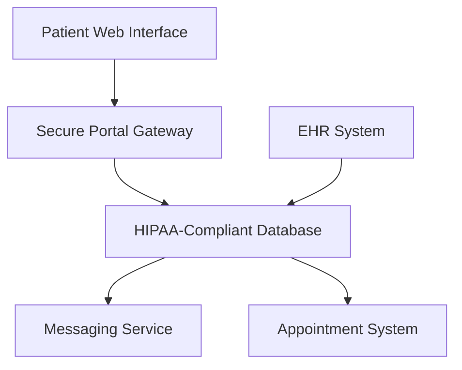

**Category:** Healthcare & Medical Hosting
**Difficulty:** Intermediate
**Reading time:** 6 min read

---

Patient portal hosting provides HIPAA-compliant web platforms enabling patients to securely access their medical records, schedule appointments, communicate with providers, request prescriptions, and manage healthcare engagement. These platforms integrate with EHR systems to centralize patient interactions and improve care coordination.

- **HIPAA-Compliant Hosting** — Encrypted storage and transmission with audit logging
- **EHR Integration** — Real-time data sync from clinical systems to patient view
- **Secure Messaging** — Encrypted communication between patients and healthcare providers
- **Appointment Management** — Online booking, rescheduling, and reminder systems
- **Records Access** — Patient download and sharing of medical records and test results

Patient portal hosting operates on cloud infrastructure with data encryption at rest using AES-256 and in-transit using TLS 1.2+. Portals integrate with EHR systems via secure APIs, pulling patient demographics, clinical data, appointment schedules, and lab results in real-time. Authentication uses multi-factor authentication with secure password policies. The messaging component routes patient inquiries to appropriate clinical staff with response time tracking. Appointment systems sync with provider schedules, preventing double-booking and sending automated reminders via email or SMS. Access controls ensure patients see only their own records. Audit logs track all access and modifications for compliance with HIPAA accounting of disclosures and security requirements.

- Hospital and health system patient engagement platforms
- Multi-specialty practices providing unified patient experience
- Telehealth integration enabling remote visit scheduling and follow-up
- Patient education and health literacy initiatives
- Medication management and prescription refill workflows
- Chronic disease management with remote monitoring capabilities

| Advantage | Disadvantage |
|-----------|--------------|
| Improves patient engagement and satisfaction | Implementation complexity with EHR integration |
| Reduces administrative burden of phone calls and paperwork | Initial cost and ongoing compliance requirements |
| Enables asynchronous communication reducing clinical wait time | Staff training on portal-related workflows needed |
| Supports patient safety through records access and transparency | Privacy concerns require robust security measures |
| Analytics on portal usage inform engagement strategies | Adoption requires patient digital literacy |

- [Telemedicine platform hosting](telemedicine-platform-hosting.md)
- [Healthcare compliance monitoring](healthcare-compliance-monitoring.md)
- [FHIR API hosting](fhir-api-hosting.md)

---
*Part of the [Healthcare & Medical Hosting](healthcare-medical-hosting/index.md) category · [Back to Master Index](../../index.md)*