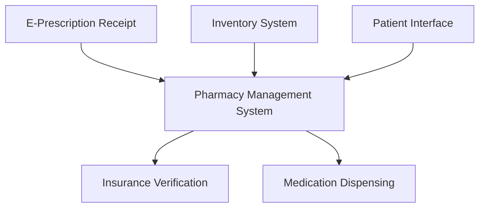

**Category:** Healthcare & Medical Hosting
**Difficulty:** Intermediate
**Reading time:** 6 min read

---

Pharmacy management systems provide cloud-based platforms for managing pharmacy operations including prescription fulfillment, inventory management, insurance verification, and patient counseling. These systems integrate with healthcare provider networks and insurance systems to streamline medication dispensing workflows.

- **Prescription Fulfillment** — Receipt, verification, and dispensing of prescriptions
- **Inventory Management** — Real-time tracking of medication stock and automated reordering
- **Insurance Verification** — Real-time eligibility checks and prior authorization workflows
- **Patient Records** — Medication history and interaction checking for patient safety
- **Regulatory Compliance** — Compliance with state pharmacy licensing and DEA regulations

Pharmacy management platforms operate on HIPAA-compliant cloud infrastructure with integration to pharmacy networks and insurance systems. E-prescriptions arrive through secure channels and are queued for verification. The system checks patient medication history for drug-drug interactions, allergies, and contraindications. Insurance verification queries payer systems in real-time for coverage and prior authorization requirements. When coverage is confirmed, the dispensing queue routes prescriptions to pharmacy technicians. Inventory management tracks medication stock, triggers reordering when thresholds are reached, and optimizes purchasing. Barcode scanning at dispensing ensures correct medication and dosage. Patient interface enables prescription tracking, refill requests, and insurance communication. Regulatory reporting includes DEA narcotic logs, state licensing requirements, and quality metrics.

- Community pharmacies managing high-volume prescription fulfillment
- Retail pharmacy chains coordinating across multiple locations
- Health system pharmacies integrated with hospital clinical workflows
- Specialty pharmacies managing complex medications and patient counseling
- Pharmacy benefit managers tracking medication compliance at scale
- Mail-order pharmacies processing bulk prescriptions efficiently

| Advantage | Disadvantage |
|-----------|--------------|
| Automation reduces manual data entry and errors | Complex insurance verification still requires human intervention |
| Inventory optimization reduces waste and stockouts | Requires integration with multiple insurance networks |
| Patient portal improves experience and communication | Regulatory requirements vary by state |
| Insurance verification speeds claim processing | DEA compliance adds operational complexity |
| Integrates with healthcare provider networks | Specialty medications require additional workflows |

- [E-prescribing (EPCS) hosting](e-prescribing-epcs-hosting.md)
- [Prescription management systems](prescription-management-systems.md)
- [Healthcare compliance monitoring](healthcare-compliance-monitoring.md)

---
*Part of the [Healthcare & Medical Hosting](healthcare-medical-hosting/index.md) category · [Back to Master Index](../../index.md)*