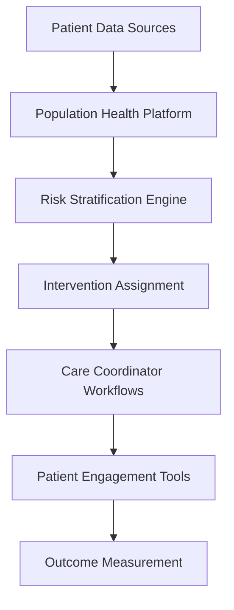

**Category:** Healthcare & Medical Hosting
**Difficulty:** Intermediate
**Reading time:** 6 min read

---

Population health management platforms provide cloud-based infrastructure for analyzing and improving health outcomes across defined patient populations. These platforms identify high-risk patients, enable targeted interventions, track outcomes, and support value-based care delivery models.

- **Risk Stratification** — Identification of high-risk patients based on clinical and social data
- **Care Coordination** — Management of multi-disciplinary care team workflows
- **Patient Engagement** — Tools for patient communication and behavioral health interventions
- **Outcome Tracking** — Measurement of clinical outcomes and population health metrics
- **Social Determinants** — Integration of social, behavioral, and environmental factors in health

Population health platforms integrate data from EHRs, claims systems, and social determinant data providers to create comprehensive patient profiles. Risk stratification algorithms identify high-risk patients using predictive models incorporating clinical, utilization, and social factors. Care coordinators receive worklists prioritizing high-risk patients. The platform provides tools for managing care plans, coordinating with providers across care teams, and tracking intervention completion. Patient engagement tools deliver targeted health education, medication reminders, and behavioral health support. Outcome dashboards track changes in clinical metrics, utilization patterns, and health costs. Analytics identify which interventions drive the greatest impact. Integration with value-based payment models ties financial incentives to improved outcomes.

- Primary care practices managing chronic disease at population level
- Health plans optimizing care for accountable populations
- Hospital systems reducing readmissions in defined cohorts
- Integrated delivery systems managing attributed patient populations
- Care management organizations coordinating complex care
- Community health initiatives addressing social determinants

| Advantage | Disadvantage |
|-----------|--------------|
| Identifies high-risk patients for early intervention | Requires engagement from multiple care team members |
| Supports value-based contracts and risk-based models | Behavioral change among patients difficult to achieve |
| Integrates clinical and social factors for comprehensive care | Data quality issues impact risk stratification accuracy |
| Enables proactive care reducing emergency department visits | Long-term outcomes measurement requires sustained commitment |
| Provides actionable data for care improvement | Privacy and consent management with social data complex |

- [Healthcare analytics platforms](healthcare-analytics-platforms.md)
- [Clinical decision support systems](clinical-decision-support-systems.md)
- [Remote patient monitoring platforms](remote-patient-monitoring-platforms.md)

---
*Part of the [Healthcare & Medical Hosting](healthcare-medical-hosting/index.md) category · [Back to Master Index](../../index.md)*