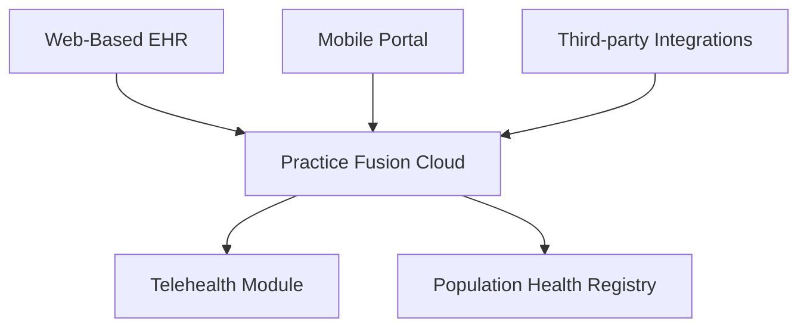

**Category:** Healthcare & Medical Hosting
**Difficulty:** Intermediate
**Reading time:** 6 min read

---

Practice Fusion is a cloud-based EHR platform designed for ambulatory practices with emphasis on ease of use, interoperability, and reducing documentation burden. It offers workflow optimization, integrated telehealth, and strong focus on provider experience and patient engagement.

- **Simplified Documentation** — Minimal-click templates reducing clinician documentation time
- **Cloud-Native Architecture** — No servers to maintain, automatic updates and backups
- **Integrated Telehealth** — Video consultation capability native to the EHR platform
- **Data Interoperability** — Standards-based APIs enabling health information exchange
- **Population Health Tools** — Registry and reporting for quality metrics and outcomes tracking

Practice Fusion operates on a cloud infrastructure with redundancy across multiple availability zones, encrypted data storage, and comprehensive HIPAA audit trails. The EHR interface emphasizes documentation efficiency through customizable templates and natural language processing for clinical note generation. Integrated telehealth handles secure video consultations with automatic note generation and billing code capture. The platform includes population health tools for tracking patient cohorts, quality metrics, and outcomes. APIs enable integration with practice management systems, labs, imaging centers, and health information exchanges. The patient portal supports appointment scheduling, secure messaging, and records access. Multi-provider group management enables centralized administration across multiple locations with local customization.

- Primary care and family medicine practices seeking simplified EHR
- Practices implementing population health initiatives
- Ambulatory surgery centers and specialty practices
- Practices wanting integrated telemedicine without separate platform
- Health systems needing cloud-based EHR alternative to legacy systems
- Practices focusing on quality metrics and outcomes reporting

| Advantage | Disadvantage |
|-----------|--------------|
| User-friendly interface reduces training and adoption friction | Less feature-rich than enterprise EHRs |
| Strong interoperability aligns with modern HIE standards | Smaller integrations ecosystem |
| Integrated telehealth avoids separate platform licensing | Customization options more limited |
| Focus on documentation efficiency saves provider time | May require practice workflow changes for optimization |
| Cloud-only means automatic updates without downtime | Dependent on vendor feature roadmap |

- [Telemedicine platform hosting](telemedicine-platform-hosting.md)
- [Healthcare interoperability platforms](healthcare-interoperability-platforms.md)
- [Healthcare analytics platforms](healthcare-analytics-platforms.md)

---
*Part of the [Healthcare & Medical Hosting](healthcare-medical-hosting/index.md) category · [Back to Master Index](../../index.md)*