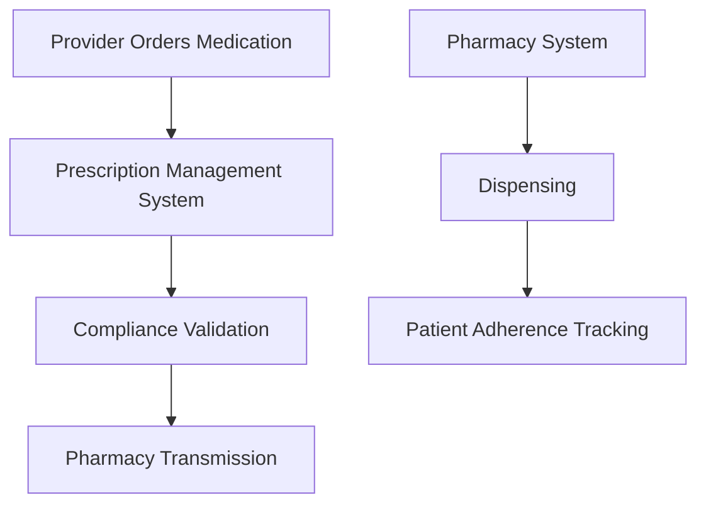

**Category:** Healthcare & Medical Hosting
**Difficulty:** Intermediate
**Reading time:** 6 min read

---

Prescription management systems provide cloud-based platforms for managing the complete medication lifecycle from clinical ordering through dispensing and patient adherence monitoring. These systems integrate with pharmacies, enable e-prescribing with electronic controls for controlled substances, and track medication compliance.

- **E-Prescribing** — Electronic transmission of prescriptions to pharmacies with regulatory compliance
- **Controlled Substance Tracking** — DEA compliance for Schedule II-V medications with CSOS integration
- **Pharmacy Integration** — Real-time connectivity with pharmacy dispensing systems
- **Medication History** — Tracking of patient medications across all prescribers
- **Adherence Monitoring** — Patient reminders and refill management for chronic medications

Prescription management platforms operate on HIPAA-compliant cloud infrastructure with integration to pharmacy networks. When a provider orders a medication, the system validates the prescription for drug-drug interactions, allergies, and dosage appropriateness using clinical decision support. For controlled substances, the system integrates with state Controlled Substance Order Systems (CSOS) to verify DEA compliance and track dispensing. E-prescriptions are transmitted to the patient's pharmacy of choice via standardized protocols (NCPDP, HL7). The pharmacy system receives the prescription, validates it, and initiates dispensing. The patient receives notifications about refills due, medication adherence reminders, and can request refills through patient portals. Reconciliation processes track medication fills and identify adherence issues. Clinical analytics provide providers visibility into medication fill rates and adherence patterns.

- Multi-specialty medical practices simplifying medication ordering
- Chronic disease management programs tracking patient adherence
- Healthcare systems integrating multiple pharmacy partners
- Practices reducing medication errors through clinical decision support
- Controlled substance prescribers requiring regulatory compliance
- Population health initiatives monitoring medication adherence at scale

| Advantage | Disadvantage |
|-----------|--------------|
| Clinical decision support reduces medication errors | Integration complexity with diverse pharmacy systems |
| E-prescribing eliminates paper processes and delays | Regulatory requirements add compliance burden |
| Adherence tracking enables intervention for non-compliance | Patient adoption varies with digital literacy |
| CSOS integration automates controlled substance compliance | Specialty/compounded medications not well supported |
| Pharmacy integration improves fill rates and patient outcomes | Cost of pharmacy network connectivity |

- [E-prescribing (EPCS) hosting](e-prescribing-epcs-hosting.md)
- [Pharmacy management systems](pharmacy-management-systems.md)
- [Clinical decision support systems](clinical-decision-support-systems.md)

---
*Part of the [Healthcare & Medical Hosting](healthcare-medical-hosting/index.md) category · [Back to Master Index](../../index.md)*