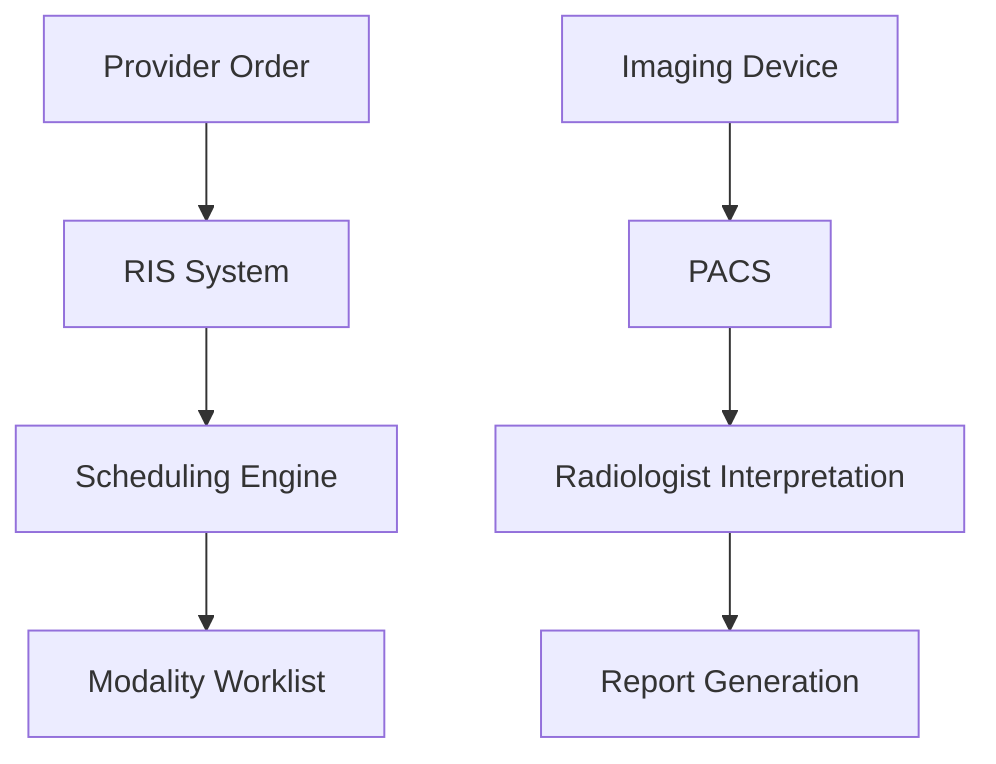

**Category:** Healthcare & Medical Hosting
**Difficulty:** Intermediate
**Reading time:** 6 min read

---

Radiology Information Systems (RIS) provide cloud-based platforms for managing radiology operations including order management, scheduling, result reporting, and integration with imaging devices and PACS. RIS systems organize diagnostic imaging workflows and enable efficient imaging center operations.

- **Order & Scheduling** — Management of imaging orders and technologist scheduling
- **Modality Worklists** — Transmission of patient and study information to imaging devices
- **Results Reporting** — Integration with radiologist interpretation and report generation
- **PACS Integration** — Connection to medical imaging storage systems
- **Audit & Compliance** — Tracking of imaging performed and quality assurance

RIS platforms host on HIPAA-compliant cloud infrastructure with integration to imaging modalities (CT, MRI, X-ray, ultrasound) and PACS systems. Orders from providers populate the system with patient demographics and clinical indication. The scheduling engine manages appointment slots across available imaging equipment. Modality worklists are transmitted to imaging devices containing patient information and acquisition parameters. During imaging, the device captures images and sends them to PACS while updating the RIS with completion status. Radiologists access RIS-integrated workstations to interpret images and generate reports. Results are electronically delivered to ordering providers and integrated into patient EHRs. Compliance tracking includes audit logs for image access, retention of archival studies, and quality metrics for imaging appropriateness.

- Hospital radiology departments managing imaging across multiple modalities
- Imaging centers coordinating scheduling for high patient volume
- Multi-location imaging networks with centralized RIS management
- Urgent care centers integrating point-of-care ultrasound and X-ray
- Specialty imaging centers (orthopedic, cardiac, etc.) with focused protocols
- Teleradiology services providing remote interpretation and reporting

| Advantage | Disadvantage |
|-----------|--------------|
| Scheduling optimization reduces imaging technologist idle time | Modality integration complex and vendor-specific |
| Modality worklists eliminate manual entry and errors | Upfront investment in device interface engineering |
| PACS integration provides seamless imaging workflow | Limited scheduling flexibility for urgent studies |
| Report integration reduces delivery delays to providers | Workflow changes required for adoption |
| Compliance tracking supports quality improvement | Specialty imaging protocols may require customization |

- [Medical imaging (PACS) hosting](medical-imaging-pacs-hosting.md)
- [Laboratory information system (LIS)](laboratory-information-system-lis.md)
- [Healthcare compliance monitoring](healthcare-compliance-monitoring.md)

---
*Part of the [Healthcare & Medical Hosting](healthcare-medical-hosting/index.md) category · [Back to Master Index](../../index.md)*