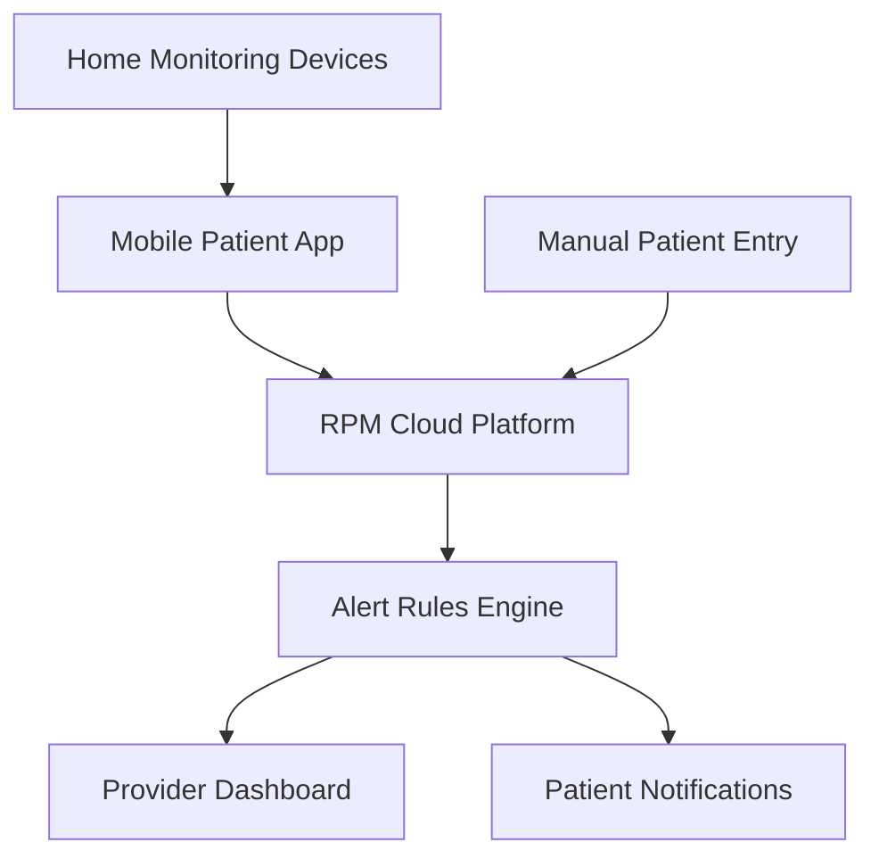

**Category:** Healthcare & Medical Hosting
**Difficulty:** Intermediate
**Reading time:** 6 min read

---

Remote patient monitoring (RPM) platforms provide cloud-based infrastructure for collecting patient health data outside clinical settings and transmitting it to providers for clinical review. RPM enables chronic disease management and early detection of deterioration while reducing unnecessary office visits and hospitalizations.

- **Patient Devices** — Integration with home monitoring devices (blood pressure cuffs, scales, pulse oximeters, glucose meters)
- **Data Transmission** — Wireless transmission of measurements to cloud platform
- **Clinical Thresholds** — Alerts when measurements exceed predefined abnormal values
- **Provider Dashboards** — Visualization of patient trend data and actionable alerts
- **Patient Engagement** — Mobile apps encouraging consistent measurement and medication adherence

RPM platforms operate on cloud infrastructure with integration to consumer and clinical-grade home monitoring devices. Patients measure vital signs using Bluetooth-connected devices (blood pressure monitors, pulse oximeters, weight scales) that transmit data to mobile apps. The app stores data locally and synchronizes with cloud platform when internet connectivity is available. Clinical data is processed against predefined thresholds based on patient diagnosis, medications, and prior readings. Abnormal values trigger alerts to clinical staff with patient context and trending information. Providers review alerts and decide whether to contact patients, adjust medications, or recommend office visits. Mobile apps provide patients with feedback on measurements, medication reminders, and educational content. Integration with EHRs enables clinical notes and billing for RPM services. Analytics track patient adherence and identify those at risk of disengagement.

- Heart failure management with daily weight monitoring for diuretic adjustment
- Chronic obstructive pulmonary disease with oxygen saturation monitoring
- Diabetes management with glucose and medication adherence tracking
- Hypertension control with blood pressure trend analysis
- Post-operative monitoring reducing recovery complications
- Pregnancy monitoring with vital signs and symptom tracking

| Advantage | Disadvantage |
|-----------|--------------|
| Early detection of deterioration prevents hospitalizations | Patient engagement and adherence challenging |
| Reduces office visit burden for stable chronic conditions | Device heterogeneity complicates integration |
| Enables providers to manage larger patient populations | Reimbursement models vary and may be limited |
| Improves patient understanding of disease trajectory | Requires significant provider workflow changes |
| Cost-effective for conditions with high readmission risk | Technical support for patients with limited digital literacy |

- [Telemedicine platform hosting](telemedicine-platform-hosting.md)
- [Clinical decision support systems](clinical-decision-support-systems.md)
- [Population health management](population-health-management.md)

---
*Part of the [Healthcare & Medical Hosting](healthcare-medical-hosting/index.md) category · [Back to Master Index](../../index.md)*