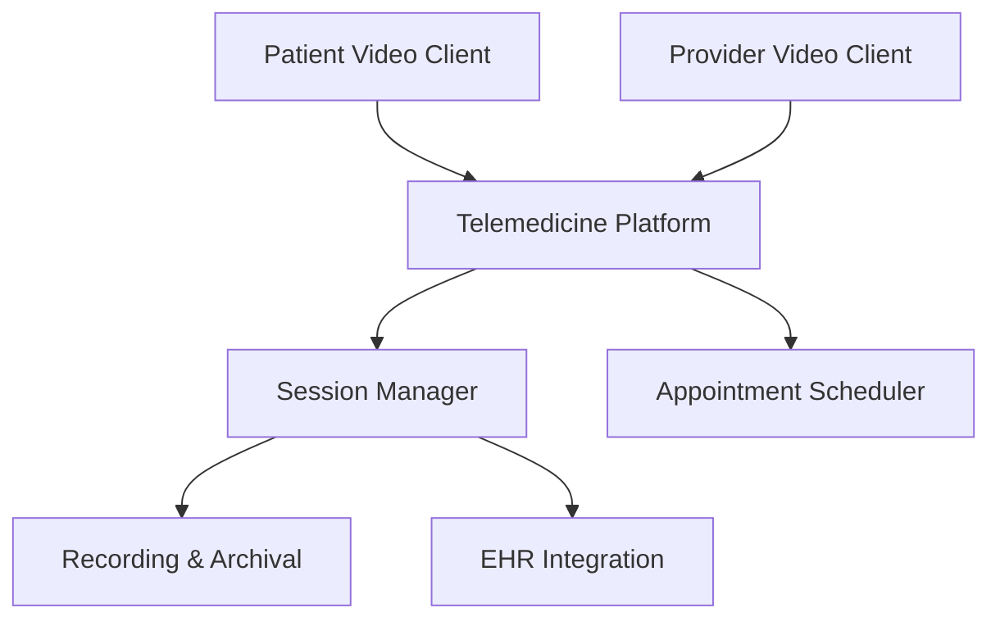

**Category:** Healthcare & Medical Hosting
**Difficulty:** Intermediate
**Reading time:** 6 min read

---

Telemedicine platform hosting provides HIPAA-compliant infrastructure for virtual healthcare delivery, enabling secure video consultations, remote monitoring, and clinical care delivery across geographic distances. These platforms integrate audio/video, clinical documentation, and billing workflows in a unified, compliant environment.

- **Video Conferencing** — Real-time encrypted video and audio for patient-provider consultations
- **Clinical Documentation** — Integration with EHR for automatic note generation and billing
- **Appointment Scheduling** — Integration with practice management and patient calendars
- **Patient Intake** — Pre-visit questionnaires and vital sign collection
- **Recording and Compliance** — Audit trails and optional recording with consent management

Telemedicine platforms host on cloud infrastructure with redundancy across multiple regions for reliability. Video streams use WebRTC or similar protocols with end-to-end encryption and secure key exchange. Provider and patient clients (browser or mobile app) establish encrypted connections to media servers, with bandwidth optimization for varying network conditions. Session management handles authentication, billing code capture, and automatic EHR integration. The platform captures vital information through pre-visit questionnaires and in-visit data entry. Recording functionality (optional with consent) stores encrypted session recordings for quality assurance and compliance. Integration with practice management systems auto-generates billing based on visit type, duration, and provider credentials. Compliance monitoring includes access logs, session records, and audit trails for HIPAA documentation.

- Primary care practices expanding access across rural or underserved areas
- Specialty consultations reducing patient travel and wait times
- Mental health practices serving distributed patient populations
- Post-operative follow-up visits reducing in-person clinic burden
- Remote patient monitoring with vital sign transmission
- International healthcare delivery across time zones

| Advantage | Disadvantage |
|-----------|--------------|
| Expands access to care in remote or underserved areas | Internet bandwidth requirements limit some users |
| Reduces patient travel burden and wait times | Requires provider training and behavior change |
| Integrates clinical workflow reducing context switching | Privacy concerns with home-based provider visits |
| Enables asynchronous care components (monitoring, messaging) | Regulatory requirements vary by state/country |
| Reduces operational costs from facility overhead | Less suitable for physical examination-heavy specialties |

- [Patient portal hosting](patient-portal-hosting.md)
- [Remote patient monitoring platforms](remote-patient-monitoring-platforms.md)
- [Healthcare compliance monitoring](healthcare-compliance-monitoring.md)

---
*Part of the [Healthcare & Medical Hosting](healthcare-medical-hosting/index.md) category · [Back to Master Index](../../index.md)*