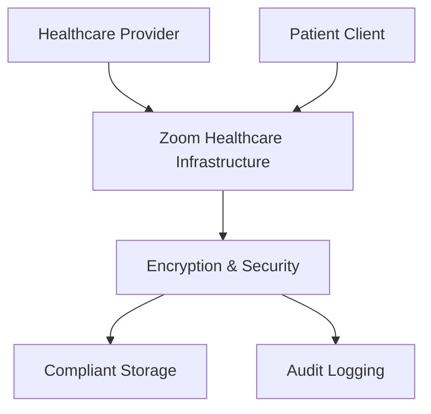

**Category:** Healthcare & Medical Hosting
**Difficulty:** Intermediate
**Reading time:** 6 min read

---

Zoom for Healthcare is an enhanced, HIPAA-compliant version of Zoom's conferencing platform designed specifically for healthcare organizations. It includes stricter access controls, enhanced encryption, meeting recording management, and audit logging required for healthcare compliance while leveraging Zoom's reliable video infrastructure.

- **HIPAA Business Associate Agreement** — Legal compliance framework for covered entities
- **Enhanced Encryption** — AES 256-bit encryption with FIPS compliance option
- **Meeting Recording Management** — Compliance-focused recording storage and retention policies
- **Access Controls** — Role-based permissions and meeting data isolation
- **Secure Data Handling** — Automatic deletion of data per compliance requirements

Zoom for Healthcare operates on Zoom's global infrastructure with HIPAA compliance validated through Business Associate Agreements (BAA) with healthcare organizations. The platform uses AES-256 encryption for data in transit and at rest. Meeting recordings are stored in compliant data centers with automatic deletion options configured per organizational policy. Access controls ensure only authorized personnel can access recordings or join meetings. Audit logs track all participant access, recording status, and administrative changes for HIPAA compliance verification. Administrative dashboards provide visibility into meeting compliance status, storage usage, and retention policies. Integration with single sign-on (SSO) systems ties meeting access to employee credentials and role-based access controls.

- Large hospital systems requiring video infrastructure across multiple departments
- Multi-state healthcare providers needing consistent compliance framework
- Hybrid telehealth models integrating video with existing practice management systems
- Healthcare administrative meetings requiring HIPAA compliance
- Educational and training sessions for healthcare professionals
- Grand rounds and specialty consultation meetings across medical centers

| Advantage | Disadvantage |
|-----------|--------------|
| Familiar Zoom interface reduces training overhead | General platform adapted for healthcare (not purpose-built) |
| Global infrastructure ensures reliability and performance | BAA adds licensing cost compared to standard Zoom |
| Mature platform with extensive feature set | Recording management requires organizational policies |
| Strong market presence with ecosystem integrations | Less specialized than dedicated telemedicine platforms |
| Flexible for various healthcare use cases | Privacy concerns about data residency in some regions |

- [Telemedicine platform hosting](telemedicine-platform-hosting.md)
- [Microsoft Teams for Healthcare](microsoft-teams-for-healthcare.md)
- [Healthcare compliance monitoring](healthcare-compliance-monitoring.md)

---
*Part of the [Healthcare & Medical Hosting](healthcare-medical-hosting/index.md) category · [Back to Master Index](../../index.md)*