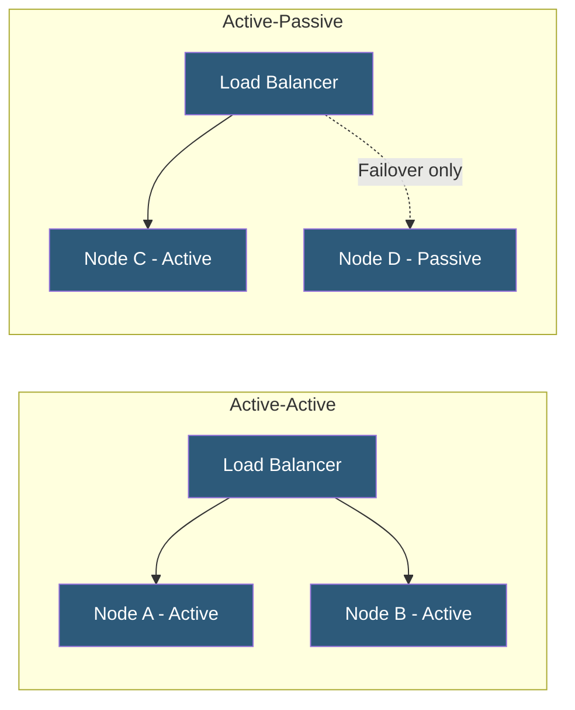

**Category:** High Availability Design
**Difficulty:** Intermediate
**Reading time:** 6 min read

---

Active-active and active-passive are the two primary redundancy topologies for high availability systems. Active-active runs all nodes simultaneously under load, while active-passive keeps standby nodes idle until failover is needed. The choice between them affects cost, performance, complexity, and recovery speed.

- **Active-active** — all nodes process traffic concurrently, providing both redundancy and load distribution
- **Active-passive** — primary node handles all traffic; standby activates only on failure
- **Hot standby** — passive node is fully synchronized and can take over in seconds
- **Warm standby** — passive node is running but requires data sync before becoming active
- **Cold standby** — passive node is powered off and requires full startup sequence
- **Failover time** — duration between primary failure detection and standby assumption of traffic
- **State synchronization** — keeping data and session state consistent across nodes
- **Split-brain** — condition where both nodes believe they are primary, causing data conflicts

In an active-active configuration, a load balancer or DNS round-robin distributes incoming requests across all nodes simultaneously. Each node processes a portion of the total traffic, meaning total throughput scales with the number of nodes. When a node fails, the load balancer detects this through health checks (typically within 5–30 seconds) and removes it from rotation. The remaining nodes absorb its traffic—provided they have sufficient spare capacity. This requires applications to be stateless or to share state through an external store like Redis, so any node can handle any request.

Active-passive configurations designate one node as primary and keep one or more nodes in standby. The standby monitors the primary using heartbeat signals (VRRP, Keepalived, Pacemaker). When the primary fails, the standby promotes itself, claims the shared IP address or DNS entry, and begins accepting traffic. Hot standby systems achieve failover in under 30 seconds. Warm standby systems may take minutes due to data synchronization requirements.

Database clusters often use active-passive for writes (a single primary handles all writes to maintain consistency) while reads are distributed across read replicas in an active-active manner. This hybrid approach balances consistency requirements with horizontal read scalability.

- Web application clusters using active-active for horizontal scaling
- Database primary/replica configurations with active-passive writes
- DNS servers deployed in active-active for global query distribution
- Firewall clusters using active-passive for stateful session continuity
- Storage controllers in active-active for maximum throughput

| Advantage | Disadvantage |
|-----------|--------------|
| Active-active uses all capacity efficiently | Active-active requires stateless or shared-state design |
| Active-passive simpler to implement for stateful apps | Active-passive wastes standby node capacity |
| Active-active provides instant failover | Active-passive has failover detection delay |
| Active-passive avoids split-brain complexity | Active-active needs robust split-brain prevention |

- [Redundancy Strategies](redundancy-strategies.md)
- [Load Balancer Redundancy](load-balancer-redundancy.md)
- [Split-Brain Prevention](split-brain-prevention.md)

---
*Part of the [High Availability Design](index.md) category · [Back to Master Index](../../index.md)*
