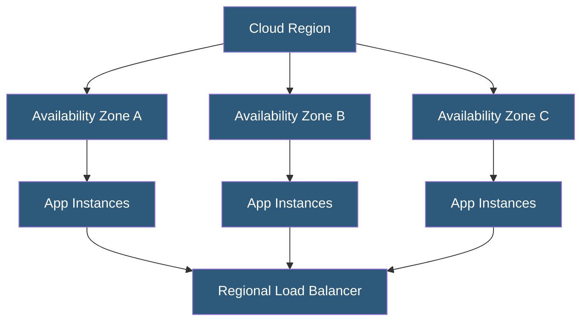

**Category:** High Availability Design
**Difficulty:** Beginner
**Reading time:** 5 min read

---

Availability zones (AZs) are physically separate datacenter facilities within a single cloud region, each with independent power, cooling, and networking. Deploying across multiple AZs protects applications from datacenter-level failures while maintaining low inter-AZ latency for synchronous replication.

- **Availability zone** — independent datacenter cluster within a region with separate power, cooling, and networking
- **AZ failure** — outage affecting one zone without impacting others in the same region
- **Cross-AZ traffic** — network communication between instances in different availability zones
- **AZ-aware placement** — ensuring instances of a service are distributed across multiple zones
- **Regional service** — cloud service that spans all AZs and is not zone-specific
- **Zonal service** — cloud service tied to a specific availability zone
- **Zone pinning** — intentionally deploying resources in a specific AZ (reduces cross-AZ costs)
- **AZ isolation** — blast radius of failures is contained within a single zone

Cloud providers design availability zones as independent failure domains within a single region. AWS regions typically offer three or more AZs; Azure and GCP provide similar structures. Each AZ has its own power substations, UPS systems, diesel generators, cooling plants, and network connections to the provider backbone. Physical separation of at least several kilometers between zones ensures that a fire, flood, or power grid failure in one zone does not affect others.

Inter-AZ latency within a region is typically under 2 milliseconds, making synchronous data replication between zones feasible without significant application performance impact. This is the key advantage over multi-region deployments, where latency of 10–100+ ms makes synchronous writes impractical.

To leverage AZ redundancy, compute instances must be explicitly placed across multiple zones using placement groups, auto-scaling group configuration, or managed service replication settings. AWS RDS Multi-AZ deploys a synchronous standby replica in a different AZ, automatically failing over in 60–120 seconds when the primary becomes unavailable. Kubernetes node groups are spread across AZs using topology spread constraints. Managed services like DynamoDB, S3, and Azure Cosmos DB are inherently multi-AZ within a region.

Cross-AZ data transfer incurs network charges (typically $0.01–0.02/GB). Applications with very high data transfer volumes between AZs may need to consider zone affinity for data-intensive components, accepting reduced redundancy in exchange for cost control.

- Web application tiers deployed across three AZs for 99.99% availability
- Database clusters with synchronous multi-AZ replication
- Kubernetes workloads spread across AZs via topology constraints
- Managed queue services (SQS, Service Bus) with cross-AZ durability
- Auto-scaling groups balanced across zones for compute redundancy

| Advantage | Disadvantage |
|-----------|--------------|
| Protects against datacenter-level failures | Cross-AZ network transfer incurs costs |
| Low inter-AZ latency enables synchronous replication | AZ-level failure still affects zonal resources |
| Simpler than multi-region while providing strong HA | All AZs in a region share the same geographic risks |
| Provider manages physical isolation | Zone selection requires understanding of service placement |

- [Geographic Redundancy](geographic-redundancy.md)
- [Multi-Region Deployment](multi-region-deployment.md)
- [Redundancy Strategies](redundancy-strategies.md)

---
*Part of the [High Availability Design](index.md) category · [Back to Master Index](../../index.md)*
