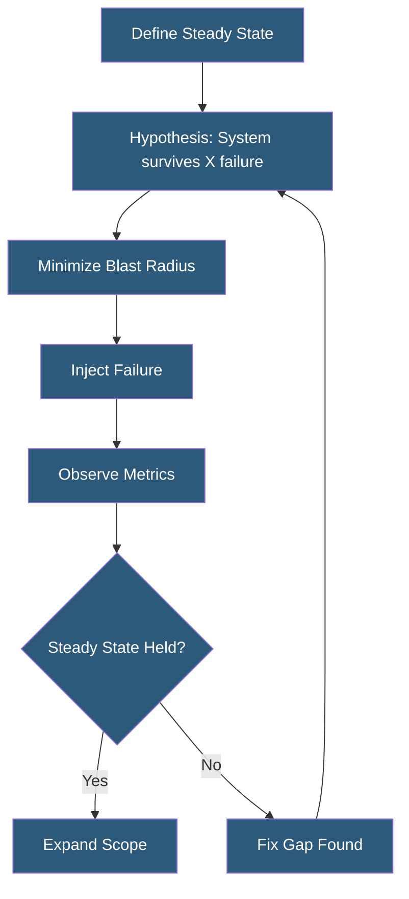

**Category:** High Availability Design
**Difficulty:** Advanced
**Reading time:** 7 min read

---

Chaos engineering is the practice of deliberately introducing controlled failures into production systems to validate that they behave correctly under failure conditions. Pioneered by Netflix, it has become a core discipline for teams operating large-scale distributed systems, revealing resilience gaps that cannot be found through traditional testing.

- **Chaos experiment** — controlled test introducing a specific failure to observe system behavior
- **Steady state hypothesis** — measurable baseline (error rate, latency) that should hold despite injected failures
- **Chaos Monkey** — Netflix tool that randomly terminates EC2 instances to verify resilience
- **Simian Army** — Netflix suite of chaos tools targeting specific failure categories
- **Game day** — scheduled chaos exercise with coordinated team participation
- **Blast radius** — scope of users or services impacted by a chaos experiment
- **Rollback** — mechanism to immediately stop a chaos experiment if impact exceeds tolerance
- **Observability** — prerequisite for chaos engineering; metrics, logs, and traces must exist to measure impact

Chaos engineering follows a structured scientific method. First, define a measurable steady state—the normal system behavior expressed in metrics such as requests per second, error rate below 0.1%, and p99 latency under 500 ms. Second, form a hypothesis: "If we terminate one of the three application servers, steady state will be maintained." Third, run the experiment with the smallest possible blast radius—start with a single instance in a low-traffic region, not all instances globally.

Failure injection can target different layers. Infrastructure failures include instance termination (Chaos Monkey), disk fill (Gremlin), memory exhaustion, and CPU spike. Network failures include latency injection (adding 200 ms delay to all calls to a service), packet loss (5% random packet drop), and complete network partition between services. Application failures include process kills, thread pool exhaustion, and dependency timeout simulation.

Gremlin provides a commercial chaos engineering platform with a rich library of attacks, a safety mechanism to halt experiments instantly, and integration with monitoring tools to verify steady state. AWS Fault Injection Simulator (FIS) integrates with the AWS ecosystem, supporting experiments targeting EC2, ECS, RDS, and EKS without additional tooling.

The key discipline is running experiments with the minimum blast radius needed to test the hypothesis, then expanding scope as confidence grows. Start with a staging environment to validate experiment mechanics. When running in production, have the on-call engineer actively monitoring dashboards with a finger on the abort button. Document every experiment, including what was tested, what metrics were measured, and what gaps were found.

- Netflix-style continuous chaos in production to validate instance termination resilience
- Pre-launch chaos testing of new microservices before full traffic exposure
- Quarterly game days simulating database failover or AZ outage
- Network fault injection to test circuit breaker and timeout configurations
- Kubernetes node chaos to validate pod rescheduling and PodDisruptionBudgets

| Advantage | Disadvantage |
|-----------|--------------|
| Finds resilience gaps before real failures do | Requires mature observability infrastructure as prerequisite |
| Builds team confidence in system behavior under failure | Risk of unintended customer impact if experiments are misconfigured |
| Validates that HA controls actually work as designed | Cultural resistance from teams uncomfortable with deliberate failures |
| Continuously validates resilience as systems evolve | Requires sustained team investment; not a one-time activity |

- [HA Testing Procedures](ha-testing-procedures.md)
- [HA Monitoring and Alerting](ha-monitoring-and-alerting.md)
- [Graceful Degradation](graceful-degradation.md)

---
*Part of the [High Availability Design](index.md) category · [Back to Master Index](../../index.md)*
