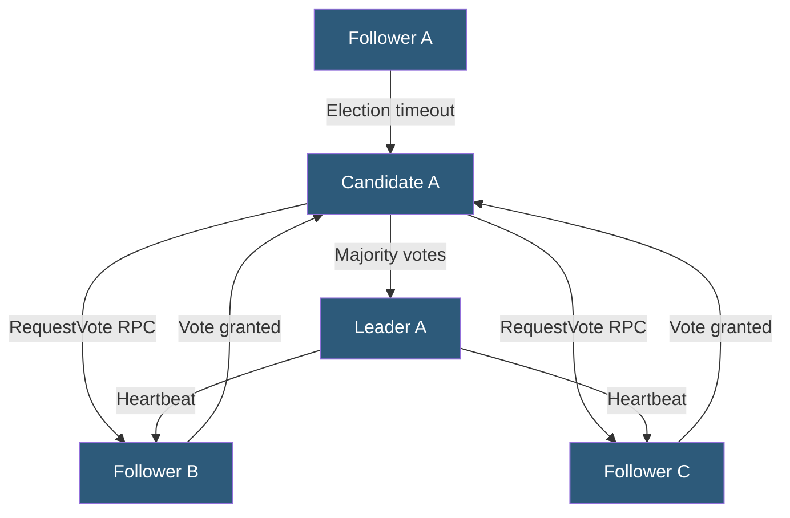

**Category:** High Availability Design
**Difficulty:** Advanced
**Reading time:** 7 min read

---

Consensus algorithms enable a distributed cluster of nodes to agree on a single value or sequence of operations despite node failures and network delays. Paxos was the foundational theoretical algorithm; Raft was designed as a more understandable alternative and has become the implementation standard for systems like etcd, Consul, and CockroachDB.

- **Consensus** — process by which distributed nodes agree on a single value, even with failures
- **Paxos** — original consensus algorithm by Leslie Lamport; highly optimized but notoriously difficult to implement correctly
- **Raft** — consensus algorithm designed for understandability; uses leader-based log replication
- **Term** — Raft's monotonic election period number; prevents stale leaders from being obeyed
- **Log replication** — leader appends entries to followers' logs; committed when majority acknowledges
- **Leader election** — Raft process for electing a new leader when the current leader fails
- **Heartbeat** — leader sends periodic empty AppendEntries RPCs to maintain authority and prevent elections
- **Log commitment** — entry is committed once a majority of nodes have appended it to their logs

Raft divides the consensus problem into three relatively independent sub-problems: leader election, log replication, and safety. Every node starts as a follower. If a follower receives no communication from a leader within an election timeout (randomized 150–300ms), it transitions to candidate and requests votes from peers. A candidate that receives votes from a majority of nodes becomes the leader for that term.

Once a leader is elected, all client writes go to the leader. The leader appends the entry to its own log and sends AppendEntries RPCs to all followers in parallel. When a majority of followers acknowledge receipt, the leader marks the entry as committed and applies it to its state machine. Committed entries are durable—they will not be lost even if subsequent failures occur.

When the leader fails, followers timeout and a new election begins. Raft's safety property guarantees that the new leader must have all committed entries. This is ensured by the vote granting rule: a follower only grants a vote to a candidate whose log is at least as up-to-date as its own (compared by term and log index). Since committed entries exist on a majority of nodes, any candidate that wins a majority election must have those entries.

Paxos achieves the same guarantees through a two-phase protocol (Prepare/Promise, then Accept/Accepted) but does not specify how to handle many practical concerns like leader election, log compaction, or cluster membership changes. Multi-Paxos extends the basic algorithm for repeated consensus on log entries. The difficulty of correctly implementing Paxos led Diego Ongaro to design Raft specifically for ease of understanding and implementation, publishing the 2014 paper "In Search of an Understandable Consensus Algorithm."

- etcd distributed key-value store powering Kubernetes cluster state
- Consul service mesh coordination and service discovery
- CockroachDB distributed transactions using multi-Raft
- ZooKeeper (Zab protocol, related to Paxos) for Kafka coordination
- TiKV distributed storage engine in TiDB using Raft

| Advantage | Disadvantage |
|-----------|--------------|
| Raft is significantly easier to understand and implement than Paxos | Strong consistency requires majority acknowledgment, adding latency |
| Guarantees safety even with arbitrary node failures | Cluster halts when quorum is unavailable |
| Formal proofs of correctness exist for both algorithms | Leader becomes a bottleneck for all writes |
| Widely deployed in production-proven systems | Network partitions can trigger repeated leader elections |

- [Quorum-Based Systems](quorum-based-systems.md)
- [Leader Election Mechanisms](leader-election-mechanisms.md)
- [Split-Brain Prevention](split-brain-prevention.md)

---
*Part of the [High Availability Design](index.md) category · [Back to Master Index](../../index.md)*
