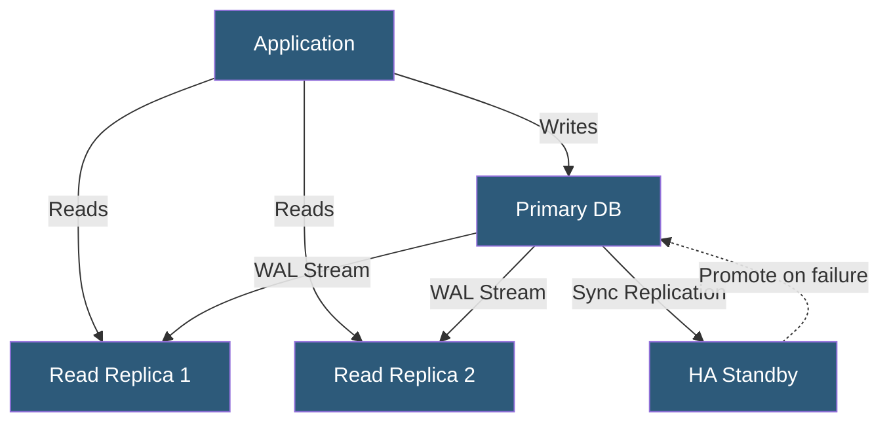

**Category:** High Availability Design
**Difficulty:** Advanced
**Reading time:** 7 min read

---

Database replication is the process of copying data changes from a primary database to one or more replicas to provide redundancy, read scalability, and disaster recovery capability. Understanding synchronous vs. asynchronous replication trade-offs is essential for designing systems that balance consistency guarantees with performance requirements.

- **Synchronous replication** — write acknowledged only after committed on both primary and replica; zero data loss
- **Asynchronous replication** — write acknowledged at primary immediately; replica catches up in background
- **Semi-synchronous replication** — write acknowledged after at least one replica confirms receipt
- **Replica lag** — delay between primary and replica state; indicates potential data loss window
- **Read replica** — replica used exclusively for read queries to distribute load
- **Failover promotion** — process of elevating a replica to primary after primary failure
- **WAL (Write-Ahead Log)** — PostgreSQL transaction log used as replication stream
- **GTID (Global Transaction Identifier)** — unique ID per transaction enabling consistent replica failover

PostgreSQL implements streaming replication by shipping WAL records from the primary to connected standbys. Standbys in hot standby mode can serve read queries while replaying incoming WAL. Synchronous standby configuration (`synchronous_commit = on`) waits for WAL to be written and flushed on the standby before acknowledging a transaction—guaranteeing zero data loss but increasing write latency by one network round trip.

MySQL and MariaDB use binary log (binlog) replication. GTIDs provide a globally unique identifier for every committed transaction, enabling replicas to resume replication from the correct position after a failover without manual log file and position tracking.

Automatic failover requires an orchestration layer. Patroni (PostgreSQL), MHA (MySQL), or Orchestrator (MySQL) continuously monitor the primary, detect failures, and coordinate replica promotion. These tools handle the complex tasks of selecting the most up-to-date replica, fencing the failed primary to prevent split-brain, and updating DNS or proxy endpoints to redirect application connections.

Managed database services abstract much of this complexity. Amazon RDS Multi-AZ uses synchronous block-level replication to a standby and automatically fails over in 60–120 seconds. Aurora maintains six copies of data across three AZs and provides automatic failover in under 30 seconds. PlanetScale and CockroachDB are distributed databases that natively handle multi-node replication using consensus protocols, eliminating the need for separate HA tooling.

- E-commerce platforms distributing read load across multiple replicas
- Financial systems using synchronous replication for zero data loss guarantee
- Reporting systems using dedicated read replicas to avoid impacting transactional performance
- Multi-region applications with async cross-region replicas for DR
- Analytics pipelines reading from replicas to avoid production query interference

| Advantage | Disadvantage |
|-----------|--------------|
| Synchronous replication guarantees zero data loss | Synchronous replication increases write latency |
| Read replicas horizontally scale query throughput | Replica lag can cause stale reads |
| Automated failover reduces recovery time | Failover promotion complexity can cause brief outages |
| Protects against primary hardware failure | Logical errors replicate to all replicas immediately |

- [High Availability Architecture Principles](high-availability-architecture-principles.md)
- [Failover Automation](failover-automation.md)
- [Split-Brain Prevention](split-brain-prevention.md)

---
*Part of the [High Availability Design](index.md) category · [Back to Master Index](../../index.md)*
