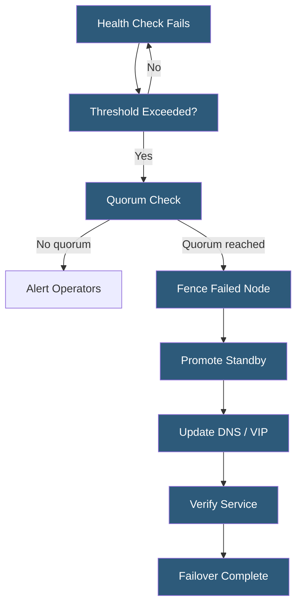

**Category:** High Availability Design
**Difficulty:** Advanced
**Reading time:** 7 min read

---

Failover automation uses monitoring agents, orchestration frameworks, and distributed consensus protocols to detect component failures and execute recovery procedures without human intervention. Automated failover reduces recovery time from hours to seconds and eliminates human error from the most time-critical recovery operations.

- **Health check** — periodic probe verifying a component is functional and accepting traffic
- **Fencing (STONITH)** — isolating a failed node to prevent it from corrupting shared resources before failover
- **Quorum** — minimum number of nodes that must agree before taking failover action
- **Pacemaker** — open-source cluster resource manager managing failover for Linux services
- **Keepalived** — lightweight HA solution for IP failover using VRRP
- **Patroni** — PostgreSQL HA template using etcd or Consul for distributed consensus
- **Orchestrator** — topology-aware MySQL/MariaDB failover and replication management tool
- **RTO** — recovery time objective; target time to restore service after failure detection

Automated failover systems continuously monitor primary components using health probes—TCP port checks, HTTP endpoint responses, database query success, or custom scripts. When a probe fails, the failover system waits for a configurable threshold of consecutive failures before treating it as a genuine failure (to avoid triggering on transient network glitches).

Before promoting a standby, the system must ensure the failed primary cannot still be running and accepting writes, which would create split-brain. This is accomplished through STONITH (Shoot The Other Node In The Head)—powering off the failed server via IPMI/iDRAC/iLO, rebooting it through a managed PDU, or revoking its network access. Only after successful fencing does promotion proceed.

Quorum mechanisms prevent failover in scenarios where the failover system itself has lost communication but the primary is still healthy. A three-node cluster requires at least two nodes to agree that the primary has failed before acting. This prevents a network partition from causing both primary and standby to simultaneously believe they are the leader.

For databases, Patroni uses etcd or Consul as a distributed configuration store and lock service. When a primary fails, replicas compete for a distributed lock. The replica with the most current data wins the lock and promotes itself. Patroni updates a configuration key that applications use to discover the current primary endpoint. MHA (MySQL HA) uses a similar model with GTID-based consistency verification before promotion.

- PostgreSQL clusters using Patroni with etcd for sub-30-second database failover
- Linux service clusters using Pacemaker/Corosync for stateful application failover
- Load balancer pairs using Keepalived/VRRP for VIP failover
- Kubernetes node failure recovery using pod rescheduling
- Cloud infrastructure with auto-healing instance groups

| Advantage | Disadvantage |
|-----------|--------------|
| Recovery in seconds vs. hours for manual failover | Incorrect configuration can trigger unnecessary failovers |
| Eliminates human error under stressful failure conditions | Fencing failures can block automated recovery entirely |
| Enables meeting aggressive RTO SLAs | Distributed consensus adds complexity and potential failure modes |
| Reduces on-call burden for routine failures | Requires thorough testing to validate failover correctness |

- [Health Check Design](health-check-design.md)
- [Split-Brain Prevention](split-brain-prevention.md)
- [Quorum-Based Systems](quorum-based-systems.md)

---
*Part of the [High Availability Design](index.md) category · [Back to Master Index](../../index.md)*
