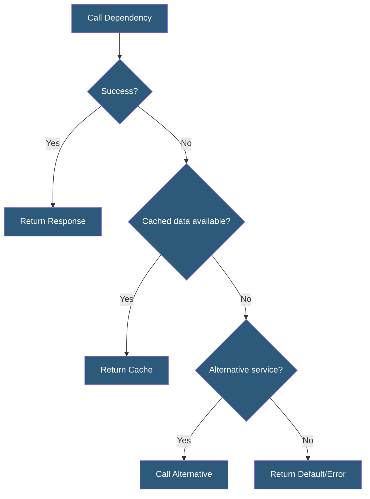

**Category:** High Availability Design
**Difficulty:** Intermediate
**Reading time:** 5 min read

---

Fallback mechanisms provide alternative execution paths when primary operations fail, preventing single dependency failures from propagating into user-visible errors. They range from returning cached data to switching to an alternative service provider, and are central to building resilient distributed systems.

- **Fallback function** — alternative logic executed when primary operation fails or times out
- **Cache fallback** — serving previously cached data when the live source is unavailable
- **Static fallback** — returning hardcoded defaults when dynamic data is unavailable
- **Alternative provider** — switching to a secondary vendor (e.g., backup payment processor)
- **Stub response** — returning a safe, minimal response that allows callers to continue
- **Retry with backoff** — retrying a failed operation with exponential delay before fallback
- **Timeout** — maximum duration allowed for a dependency call before fallback is triggered
- **Bulkhead** — thread or connection pool isolation preventing fallback exhaustion

Fallback mechanisms are implemented at the service integration layer. Every call to an external dependency is wrapped with a handler that catches failures (exceptions, timeouts, error responses) and executes an alternative path. The fallback path is chosen based on what provides the best user experience given the available alternatives.

Cache fallbacks are the most common pattern. When a product catalog API fails, the last successful response is returned from Redis or an in-memory cache. The user sees potentially slightly stale data but experiences no error. TTL policies control how stale data can be—a 5-minute TTL on product prices is acceptable; a 5-minute TTL on account balances may not be.

For critical paths like payment processing, alternative provider fallbacks provide resilience against processor outages. A payment orchestration layer attempts the primary processor (Stripe) and on failure automatically retries against a secondary processor (Braintree). The user experiences a slight delay but the transaction completes. This requires pre-configured accounts and integration with both providers.

Static fallbacks are appropriate for non-critical features where accuracy is less important than availability. If a geolocation API fails, the application defaults to showing content for the largest market region. If a feature flag service is unreachable, features default to their safe state (off for experimental features).

Retry policies complement fallbacks by distinguishing transient failures (network hiccup, momentary rate limit) from permanent failures (service down). Exponential backoff with jitter retries the operation 2-3 times with increasing delays before triggering the fallback, preventing unnecessary fallback invocations on transient errors while not delaying users on genuine outages.

- E-commerce displaying cached product data when catalog service is degraded
- Payment processing routing to backup processor when primary fails
- Recommendation systems returning popular items when personalization service is down
- Maps applications returning last known route when routing API times out
- Authentication systems using local credential cache when identity provider is unreachable

| Advantage | Disadvantage |
|-----------|--------------|
| Prevents dependency failures from causing user errors | Stale cache data may confuse users if significantly outdated |
| Alternative providers ensure critical functions complete | Maintaining multiple provider integrations adds development cost |
| Static defaults allow graceful partial functionality | Static defaults may not be appropriate for all users |
| Implemented once and provides ongoing resilience | Complex fallback chains are difficult to test exhaustively |

- [Graceful Degradation](graceful-degradation.md)
- [Circuit Breakers for HA](circuit-breakers-for-ha.md)
- [Health Check Design](health-check-design.md)

---
*Part of the [High Availability Design](index.md) category · [Back to Master Index](../../index.md)*
