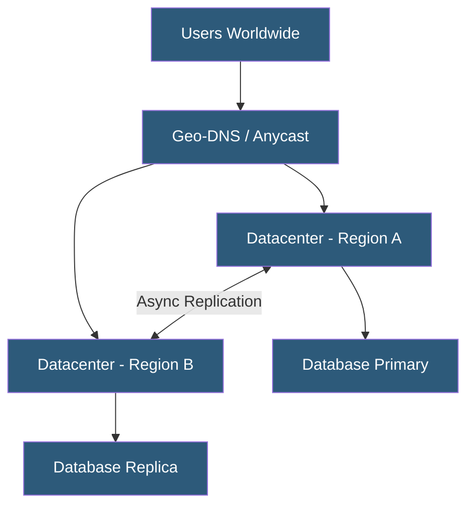

**Category:** High Availability Design
**Difficulty:** Advanced
**Reading time:** 7 min read

---

Geographic redundancy deploys infrastructure across multiple physical locations to protect against facility-level failures including natural disasters, power grid outages, and regional network disruptions. It is the highest tier of availability design, enabling service continuity even when an entire datacenter becomes unavailable.

- **Geographic redundancy** — duplicate systems in distinct physical locations separated by meaningful distance
- **Active-active geo** — all sites handle live traffic simultaneously
- **Active-passive geo** — secondary site is warm or hot standby for primary site
- **Data replication lag** — time delay in synchronizing data between geographically separated sites
- **RPO (Recovery Point Objective)** — maximum acceptable data loss when failing over to a remote site
- **Anycast routing** — single IP address announced from multiple locations; users routed to nearest site
- **Geo-DNS** — DNS responses that direct users to the nearest healthy datacenter
- **Blast radius** — scope of impact when a single site goes offline

Geographic redundancy requires deploying full or partial copies of application and data stacks in multiple datacenters separated by sufficient distance to survive regional disasters—typically at least 50–100 km apart, ideally in different seismic zones, flood plains, and power grids.

Traffic distribution between sites is handled through Geo-DNS, which resolves service hostnames to the IP of the nearest healthy site. BGP anycast achieves similar results at the network layer, routing packets to the topologically closest site announcing the same prefix. CDNs inherently use geographic redundancy, distributing edge nodes globally.

The most challenging aspect of geo-redundancy is data consistency. For synchronous replication, every write is committed at both sites before being acknowledged to the client—guaranteeing zero data loss but introducing latency proportional to the speed-of-light delay between sites (a 100 ms round trip for sites 10,000 km apart). Asynchronous replication acknowledges writes immediately and replicates in the background, enabling sub-millisecond write latency at the cost of potential data loss if the primary fails before replication completes.

Active-active geo deployments require conflict resolution strategies when both sites accept writes to the same data simultaneously. Distributed databases like CockroachDB, Cassandra, and Google Spanner handle this through consensus protocols. Many organizations instead use geographic sharding—different users or data sets are authoritative at different sites, eliminating cross-site write conflicts.

- Global SaaS platforms serving users across multiple continents
- Financial trading systems requiring disaster recovery within seconds
- Critical government infrastructure with regulatory continuity requirements
- Streaming services needing low-latency content delivery globally
- E-commerce platforms protecting against regional outage revenue loss

| Advantage | Disadvantage |
|-----------|--------------|
| Survives complete datacenter failures | Highest infrastructure cost tier |
| Reduces latency for globally distributed users | Data replication lag creates consistency trade-offs |
| Meets stringent RTO/RPO requirements | Complex traffic management and failover orchestration |
| Protects against regional natural disasters | Regulatory data residency may restrict site placement |

- [Multi-Region Deployment](multi-region-deployment.md)
- [Availability Zones](availability-zones.md)
- [Database Replication for HA](database-replication-for-ha.md)

---
*Part of the [High Availability Design](index.md) category · [Back to Master Index](../../index.md)*
