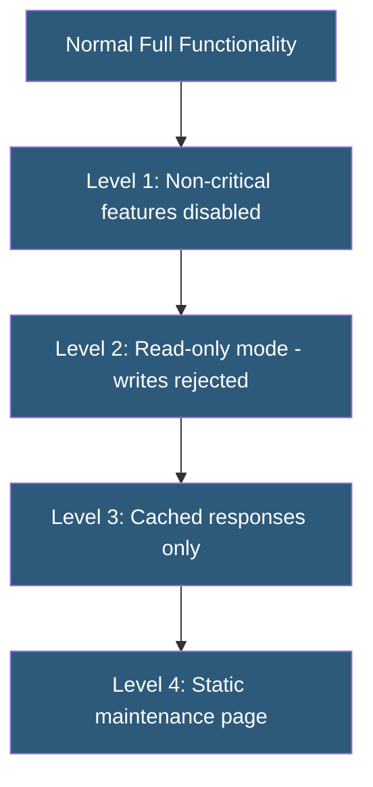

**Category:** High Availability Design
**Difficulty:** Intermediate
**Reading time:** 6 min read

---

Graceful degradation is a design strategy where a system continues to provide partial functionality when components fail, rather than failing completely. By prioritizing core functionality and shedding non-essential features during degraded conditions, systems maintain usefulness even under partial failure.

- **Graceful degradation** — system continues operating with reduced functionality when components are unavailable
- **Core function** — the essential capability a system must preserve even under failure
- **Non-critical feature** — functionality that can be disabled or approximated during degraded operation
- **Fallback content** — pre-generated or cached content served when the dynamic source is unavailable
- **Feature toggle** — runtime switch for enabling or disabling specific capabilities
- **Timeout** — maximum wait time before treating a dependency as unavailable
- **Bulkhead pattern** — isolating components so failure in one cannot propagate to others
- **Shedding load** — proactively dropping lower-priority work to protect core functionality

Graceful degradation requires designing systems with explicit awareness of which functions are critical and which are supplementary. An e-commerce site might define its degradation hierarchy as: (1) product browsing and search are always available; (2) if the recommendation engine fails, show popular products instead; (3) if the cart service is degraded, allow checkout but disable coupon validation; (4) if the payment processor is unreachable, queue orders for retry. Users lose some convenience but can still make purchases.

Implementation relies on wrapping dependency calls with timeouts and fallback logic. If a call to the recommendation service takes more than 200 ms or returns an error, the fallback function returns a cached or static list of recommended products. This is typically implemented using the circuit breaker pattern combined with a fallback function. Netflix's Hystrix library popularized this approach; Resilience4j is the modern successor.

Read-only degradation mode is particularly common for databases. If the primary database is unavailable but read replicas are healthy, write operations can be disabled while browse and search functionality continues serving traffic from replicas. CMS platforms often implement this explicitly, displaying a "read-only mode" banner while preventing new content submissions.

CDN edge caches provide a natural degradation layer for web applications. If the origin server is unavailable, the CDN can serve stale cached content beyond its normal TTL (using Cache-Control: stale-if-error). Users see slightly outdated content instead of error pages.

- E-commerce sites disabling recommendations but continuing checkout during component failures
- Social media platforms showing cached feeds when real-time services are degraded
- SaaS applications switching to read-only mode during database maintenance
- APIs returning cached data when downstream services are slow or unavailable
- Mobile apps showing offline-capable content when network connectivity is poor

| Advantage | Disadvantage |
|-----------|--------------|
| Users retain partial functionality during failures | Requires explicit design effort for every degradation level |
| Reduces user frustration compared to complete outage | Degraded mode may expose stale or inaccurate data |
| Protects core revenue-generating features | Testing all degradation levels adds significant QA burden |
| Reduces pressure on incident response by buying time | Users may not notice degraded mode and report missing features as bugs |

- [Fallback Mechanisms](fallback-mechanisms.md)
- [Circuit Breakers for HA](circuit-breakers-for-ha.md)
- [Zero-Downtime Deployments](zero-downtime-deployments.md)

---
*Part of the [High Availability Design](index.md) category · [Back to Master Index](../../index.md)*
