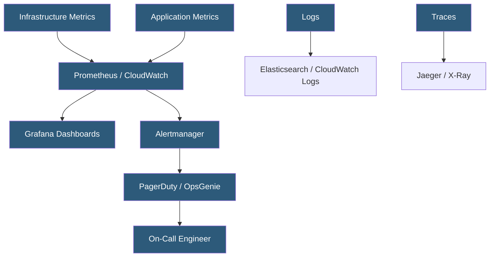

**Category:** High Availability Design
**Difficulty:** Intermediate
**Reading time:** 6 min read

---

HA monitoring and alerting provides the real-time visibility required to detect failures, measure system health, and trigger automated or manual responses. Effective monitoring covers the full stack from infrastructure metrics to application SLOs, with alerting calibrated to notify on conditions that require action without alert fatigue.

- **SLO (Service Level Objective)** — internal target for service reliability (e.g., 99.9% of requests succeed)
- **SLI (Service Level Indicator)** — measurable metric used to assess SLO compliance (e.g., error rate)
- **Error budget** — remaining allowable downtime before SLO breach; guides deployment and change risk
- **Golden signals** — four key metrics: latency, traffic, errors, and saturation
- **Alerting threshold** — metric value that triggers a notification
- **Alert fatigue** — desensitization from too many low-priority or false-positive alerts
- **Runbook** — documented response procedure linked to each alert
- **On-call rotation** — schedule defining who responds to production alerts at any given time

HA monitoring covers four layers: infrastructure (CPU, memory, disk, network), platform (Kubernetes pod status, database replication lag), application (request rate, error rate, latency), and business (transaction volume, checkout completion rate). Each layer provides different failure signals, and gaps in any layer result in blind spots.

The golden signals framework (from Google's SRE book) provides a minimal viable monitoring set. Latency measures how long requests take. Traffic measures request volume. Errors measures the rate of failed requests. Saturation measures how close resources are to their limits. Monitoring and alerting these four signals covers the majority of user-impacting failure modes.

SLO-based alerting is more effective than threshold-based alerting for production HA. Rather than alerting when CPU exceeds 80%, alert when the error rate exceeds the SLO burn rate that would exhaust the error budget within the alert window. This directly links alerts to user impact, dramatically reducing false positives. Google's SRE workbook provides detailed formulations for multi-window, multi-burn-rate alerts.

Alert routing ensures the right team is notified with the right urgency. PagerDuty and OpsGenie route alerts to on-call schedules, escalate if not acknowledged within the timeout, and can aggregate related alerts to prevent notification floods. Every alert should have a linked runbook describing the diagnostic steps and remediation actions, enabling on-call engineers to respond effectively even at 3 AM.

- Kubernetes clusters monitored with Prometheus and Grafana with PagerDuty escalation
- Database replication lag alerts triggering before lag becomes critical
- SLO burn rate alerting for customer-facing API services
- Synthetic monitoring running scripted transactions to detect functional failures
- Distributed tracing identifying which microservice introduced latency regression

| Advantage | Disadvantage |
|-----------|--------------|
| Enables detection and response before users report issues | Over-alerting causes on-call fatigue and alert dismissal |
| SLO-based alerting directly correlates to user experience | Comprehensive monitoring requires significant infrastructure investment |
| Runbook-linked alerts reduce mean time to resolution | Distributed tracing adds overhead to every request |
| Error budget tracking guides safe change velocity | Alert tuning is ongoing work as systems and baselines evolve |

- [Health Check Design](health-check-design.md)
- [MTTR (Mean Time To Repair) Reduction](mttr-mean-time-to-repair-reduction.md)
- [Chaos Engineering for HA](chaos-engineering-for-ha.md)

---
*Part of the [High Availability Design](index.md) category · [Back to Master Index](../../index.md)*
