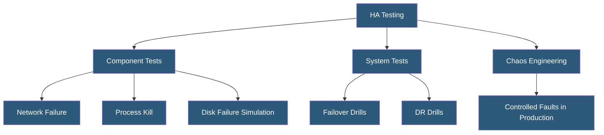

**Category:** High Availability Design
**Difficulty:** Intermediate
**Reading time:** 6 min read

---

HA testing procedures validate that redundancy mechanisms, failover automation, and recovery processes function as expected before real failures occur. Regular testing through controlled failure injection reveals configuration gaps and measures actual recovery times against SLA targets.

- **Failover drill** — planned test of the failover process by deliberately failing the primary component
- **Chaos engineering** — systematic practice of introducing controlled failures to verify resilience
- **Game day** — scheduled exercise where teams simulate major failure scenarios
- **RTO validation** — measuring actual time to recover against the recovery time objective
- **Runbook testing** — verifying that documented recovery procedures are accurate and executable
- **Dependency testing** — verifying behavior when upstream or downstream services become unavailable
- **Capacity testing** — verifying that surviving nodes can handle full load after a partial failure
- **DR drill** — full disaster recovery exercise testing complete site failover

HA testing must be performed on a schedule—at minimum annually, and ideally quarterly or after every significant infrastructure change. The testing hierarchy starts with component-level tests (kill a single process, disconnect a NIC, fail a disk) and progresses to system-level tests (fail an entire server, take down a database primary, simulate a datacenter outage).

Failover drills follow a defined procedure: notify stakeholders, establish a rollback plan, take snapshots of current state, execute the failure scenario (graceful or ungraceful shutdown of the primary), measure time to detection and recovery, verify service functionality post-failover, and document results. The actual measured RTO is compared against the SLA target. If the measured time exceeds the target, the gap is investigated and corrective action planned.

Chaos engineering tools automate failure injection at scale. Netflix's Chaos Monkey randomly terminates EC2 instances in production to verify the application survives instance failures. Gremlin provides a controlled chaos platform for CPU/memory exhaustion, network latency injection, packet loss, and process kills. AWS Fault Injection Simulator (FIS) integrates with AWS services to create controlled experiments targeting EC2, RDS, EKS, and other services.

DR drills test complete regional failover. These are typically annual events with a formal test plan. The drill exercises not just technical failover but the organizational response: communication chains, decision-making authority, vendor contacts, and manual procedures when automation fails. After the drill, a post-mortem identifies gaps in both technical systems and process.

- Quarterly database failover drills to validate sub-2-minute RTO
- Annual DR exercises testing full datacenter failover to secondary site
- Pre-launch chaos testing of new services before production exposure
- Kubernetes cluster testing by cordoning and draining nodes
- Load balancer failover testing by stopping primary LB service

| Advantage | Disadvantage |
|-----------|--------------|
| Reveals gaps before real failures cause customer impact | Testing in production carries risk of unplanned outages |
| Validates actual RTO against SLA commitments | Testing in staging may not accurately reflect production behavior |
| Builds team familiarity with recovery procedures | Regular drills require significant time investment |
| Chaos engineering finds non-obvious failure modes | Tools like Gremlin require additional licensing and expertise |

- [Chaos Engineering for HA](chaos-engineering-for-ha.md)
- [Failover Automation](failover-automation.md)
- [HA Monitoring and Alerting](ha-monitoring-and-alerting.md)

---
*Part of the [High Availability Design](index.md) category · [Back to Master Index](../../index.md)*
