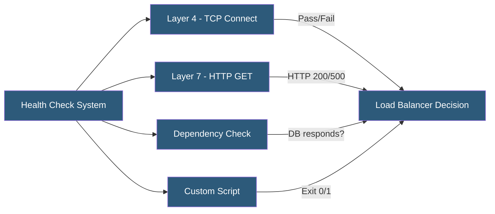

**Category:** High Availability Design
**Difficulty:** Intermediate
**Reading time:** 5 min read

---

Health checks are automated probes that determine whether a component is functioning correctly and eligible to receive traffic. Well-designed health checks balance sensitivity (detecting real failures quickly) against specificity (avoiding false positives that cause unnecessary failovers).

- **Liveness check** — determines if a process is running; failure triggers restart
- **Readiness check** — determines if a service is ready to accept traffic; failure removes from load balancer rotation
- **Startup probe** — gives a slow-starting container extra time before liveness checks begin
- **Passive health check** — infers health from observed traffic errors without active probing
- **Active health check** — sends dedicated probe requests to assess health
- **Health check endpoint** — dedicated URL (e.g., /healthz, /_health) returning service status
- **Cascading health check** — health check that verifies dependencies (database, cache) before reporting healthy
- **Check interval and threshold** — frequency of probes and consecutive failures required to declare unhealthy

Health check design starts with defining what "healthy" means for each component. Layer 4 TCP checks confirm that a port is open and a process is listening—fast but shallow. Layer 7 HTTP checks send a GET request to a health endpoint and evaluate the response code and optionally the response body—deeper but more complex.

A well-designed health endpoint does more than return HTTP 200. It should verify that the service can complete its core function: a web application health endpoint should perform a simple database read to confirm connectivity; an API service should verify that its dependency services are reachable. However, health checks must not be so thorough that they themselves cause load or take more than a few hundred milliseconds to respond.

Kubernetes implements three probe types: liveness probes trigger container restarts when they fail (for deadlock recovery), readiness probes remove pods from Service endpoints when they fail (for graceful handling of slow-starting containers or temporary overload), and startup probes give slow-starting containers additional time before liveness checks activate. These map directly to different failure modes.

Check intervals and thresholds must be tuned carefully. An interval of 5 seconds with a threshold of 3 consecutive failures means a service must be down for 15 seconds before it's removed from rotation—acceptable for most workloads. Lowering to 2 seconds and threshold of 2 reduces detection to 4 seconds but risks false positives from transient network hiccups. Load balancers like HAProxy, Nginx, and AWS ALB all support configurable intervals and thresholds.

- Kubernetes pod management using liveness and readiness probes
- Load balancer backend pool management in AWS ALB or HAProxy
- Service mesh health checks in Istio or Consul Connect
- Database cluster management tools monitoring primary health
- CDN origin health checks before serving cached content

| Advantage | Disadvantage |
|-----------|--------------|
| Enables automatic traffic routing around unhealthy instances | Overly aggressive checks cause unnecessary failovers |
| Distinguishes temporary unreadiness from permanent failure | Dependency checks can cause healthy service to appear unhealthy |
| Reduces time to detect and respond to failures | Health endpoints add attack surface if not properly secured |
| Kubernetes probes automate container lifecycle management | Poorly designed checks mask real underlying issues |

- [Failover Automation](failover-automation.md)
- [HA Monitoring and Alerting](ha-monitoring-and-alerting.md)
- [Circuit Breakers for HA](circuit-breakers-for-ha.md)

---
*Part of the [High Availability Design](index.md) category · [Back to Master Index](../../index.md)*
