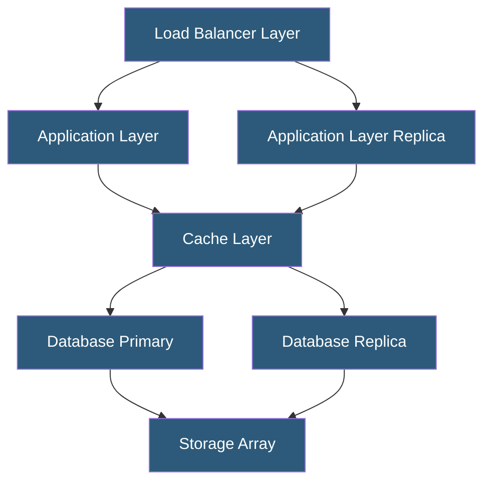

**Category:** High Availability Design
**Difficulty:** Intermediate
**Reading time:** 6 min read

---

High availability (HA) architecture ensures systems remain operational and accessible despite component failures, planned maintenance, or unexpected outages. It achieves this through redundancy, fault tolerance, and automated recovery mechanisms designed to meet defined uptime SLAs—commonly 99.9% to 99.999%.

- **Availability** — percentage of time a system is operational, expressed as nines (99.9%, 99.99%, etc.)
- **Fault tolerance** — ability to continue operation when one or more components fail
- **Redundancy** — duplication of critical components to eliminate single points of failure
- **SLA (Service Level Agreement)** — contractual uptime commitment between provider and customer
- **RTO (Recovery Time Objective)** — maximum acceptable time to restore service after failure
- **RPO (Recovery Point Objective)** — maximum acceptable data loss measured in time
- **Failover** — automatic switch to a standby component when the primary fails
- **SPOF (Single Point of Failure)** — any component whose failure causes total system unavailability

High availability architecture is built on the principle that every critical component must have a backup capable of assuming its workload automatically and immediately. The design process starts by mapping every component in a system and identifying which ones, if failed, would cause a service interruption—these are single points of failure that must be eliminated.

The architecture then applies redundancy at each layer: redundant load balancers using protocols like VRRP or BGP anycast, multiple application server instances behind the load balancer, replicated databases with automatic primary election, and redundant storage using RAID or distributed storage systems. Network paths are duplicated using multiple ISPs, redundant switches, and diverse physical cable routes.

Automation is central to HA. Health checks continuously probe each component; when a failure is detected, automated failover switches traffic to healthy replicas within seconds. Tools like Keepalived, Pacemaker, or cloud-native health checks handle this orchestration. Session continuity is preserved either through shared session stores (Redis, Memcached) or stateless application design.

The architecture must also account for the "blast radius" of failures—isolating components in separate availability zones or failure domains ensures that a single hardware or power event cannot take down all replicas simultaneously. Regular HA testing—including chaos engineering—validates that failover mechanisms work as expected under real failure conditions.

- E-commerce platforms requiring continuous transaction processing
- Financial services systems with zero-tolerance for downtime
- Healthcare platforms hosting patient-critical applications
- SaaS products with multi-tenant uptime SLAs
- Real-time communication infrastructure (VoIP, messaging)

| Advantage | Disadvantage |
|-----------|--------------|
| Dramatically reduced unplanned downtime | Significantly higher infrastructure cost |
| Automated recovery without manual intervention | Increased operational complexity |
| Supports rolling upgrades with zero downtime | Harder to debug distributed failure scenarios |
| Meets regulatory uptime requirements | Requires thorough testing discipline |

- [Redundancy Strategies](redundancy-strategies.md)
- [Single Point of Failure Elimination](single-point-of-failure-elimination.md)
- [Failover Automation](failover-automation.md)

---
*Part of the [High Availability Design](index.md) category · [Back to Master Index](../../index.md)*
