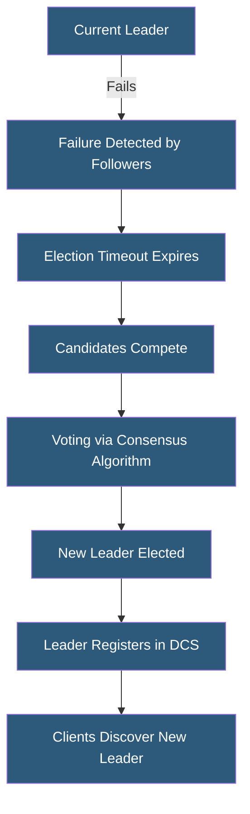

**Category:** High Availability Design
**Difficulty:** Advanced
**Reading time:** 6 min read

---

Leader election mechanisms coordinate distributed systems by designating a single authoritative node to coordinate operations, preventing conflicting concurrent actions. Modern systems use distributed lock services, consensus protocols, or lease-based approaches to elect leaders reliably even during partial failures.

- **Leader** — single authoritative node responsible for coordinating writes or cluster operations
- **Lease** — time-limited exclusive grant to act as leader; must be renewed or expires
- **Distributed lock** — exclusive token stored in a consistent store that grants leadership
- **Bully algorithm** — simple election where highest-ID node wins
- **Ring algorithm** — election token passes around a logical ring
- **Term/epoch** — monotonically increasing number preventing old leaders from interfering
- **Brain split timeout** — waiting period before concluding a leader has failed, avoiding false elections
- **Re-election** — process triggered when the current leader is suspected of failure

Modern production systems typically implement leader election through distributed configuration stores (etcd, Consul, ZooKeeper) rather than implementing a custom algorithm. A node acquires leadership by successfully creating or acquiring a key in the DCS with a TTL (time-to-live). The key acts as a distributed lease—the holder is the leader as long as it holds the lease. The leader must periodically renew the lease (before TTL expiry) to maintain leadership. If the leader fails and stops renewing, the TTL expires and other candidates can compete.

This lease-based approach has important timing properties. The leader's lease must expire before any other node can acquire it, creating a guaranteed gap between old leader activity and new leader activity. This gap prevents two nodes from simultaneously believing they are the leader. The gap duration equals the lease TTL—typically 5–15 seconds. Applications must tolerate this brief leadership vacuum.

Kubernetes uses leader election for controller manager and scheduler components. Each controller acquires a ConfigMap-based or Lease-based lock. The leader sends periodic renewals; a new leader is elected if renewals stop within the configured expiry (default 15 seconds, with 10 second renew deadline). This ensures exactly one scheduler makes pod placement decisions.

Patroni for PostgreSQL uses a different model: it stores the leader key in etcd with a TTL and the leader IP address in the key value. When the primary fails, all replicas attempt to acquire the leader key. The winner promotes itself to primary and updates its connection details in etcd. Application load balancers watch the etcd key to discover the current primary endpoint.

- Kubernetes control plane components using Lease-based election
- PostgreSQL Patroni clusters using etcd leader lock
- Apache Kafka broker controller election
- Elasticsearch master election for cluster state management
- Custom microservices requiring exactly-once background processing

| Advantage | Disadvantage |
|-----------|--------------|
| Guarantees single authoritative coordinator | Lease expiry creates brief leadership gap during failover |
| Prevents split-brain by design | DCS becomes a critical dependency |
| Re-election is automatic and fast | Short TTLs increase renewal traffic; long TTLs slow failover |
| Leader discovery is straightforward via DCS lookup | Implementing correctly from scratch is notoriously difficult |

- [Quorum-Based Systems](quorum-based-systems.md)
- [Consensus Algorithms (Raft, Paxos)](consensus-algorithms-raft-paxos.md)
- [Failover Automation](failover-automation.md)

---
*Part of the [High Availability Design](index.md) category · [Back to Master Index](../../index.md)*
