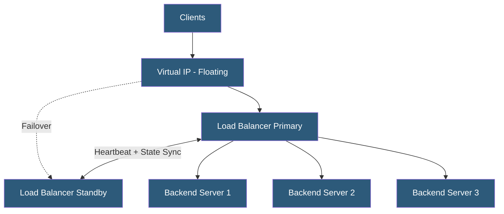

**Category:** High Availability Design
**Difficulty:** Intermediate
**Reading time:** 6 min read

---

Load balancers are themselves critical components that must be made redundant to avoid becoming single points of failure. Redundant load balancer deployments use protocols like VRRP, BGP ECMP, or cloud-native solutions to ensure traffic distribution continues uninterrupted even if a load balancer instance fails.

- **VRRP (Virtual Router Redundancy Protocol)** — assigns a virtual IP to a pair of load balancers; master/backup election
- **ECMP (Equal Cost Multi-Path)** — BGP routing that splits traffic across multiple paths/devices
- **Anycast** — single IP announced from multiple locations; clients connect to nearest instance
- **DSR (Direct Server Return)** — servers respond directly to clients, reducing return traffic through load balancer
- **Connection table replication** — synchronizing active session state between redundant load balancers
- **Health probe** — periodic checks that determine if backend servers are healthy
- **Session persistence** — routing repeat requests from a client to the same backend server
- **Floating IP** — virtual IP that moves between physical hosts during failover

On-premises and virtual load balancers are typically deployed in pairs using VRRP. One load balancer holds the MASTER role and owns the virtual IP address (VIP). The standby continuously sends VRRP advertisement packets to monitor the master. If the master fails (advertisement timeout, typically 3 seconds), the standby transitions to MASTER, claims the VIP, and begins processing traffic. ARP announcements inform upstream switches of the new MAC-to-IP mapping immediately.

For stateful applications requiring session persistence, connection table replication synchronizes active sessions between the pair in real time. HAProxy Enterprise, F5 BIG-IP, and Citrix ADC support connection mirroring. Without replication, existing sessions are dropped during failover—acceptable for stateless workloads but disruptive for long-lived connections.

Cloud-native load balancers (AWS ALB/NLB, GCP Load Balancing, Azure Load Balancer) are inherently redundant—the provider operates multiple load balancer nodes behind an anycast frontend. The user does not manage load balancer redundancy; it is guaranteed by the SLA. Cloud load balancers scale automatically and distribute traffic across availability zones.

For very high throughput requirements, BGP ECMP distributes load across multiple physical load balancer devices simultaneously. All devices are active, each handling a portion of traffic. BGP detects failures within the BGP hold-down timer (typically 90 seconds, tunable to 1–3 seconds with BFD). Large CDN and hyperscale operators commonly use this architecture.

- On-premises web farms using HAProxy or Nginx pairs with Keepalived
- Cloud deployments using provider-managed ALB/NLB with multi-AZ targets
- Hyperscale networks using ECMP across multiple physical load balancers
- DNS-layer load balancing with health-check-aware records
- Layer 4 stateful firewall clusters requiring session table synchronization

| Advantage | Disadvantage |
|-----------|--------------|
| Eliminates load balancer as SPOF | Doubles load balancer hardware/licensing cost |
| VRRP failover in under 5 seconds | Connection replication adds latency overhead |
| Cloud load balancers eliminate management burden | Cloud LBs incur per-hour and per-GB charges |
| ECMP provides active-active load distribution | BGP ECMP requires sophisticated network configuration |

- [Active-Active vs Active-Passive](active-active-vs-active-passive.md)
- [Failover Automation](failover-automation.md)
- [Network Redundancy Design](network-redundancy-design.md)

---
*Part of the [High Availability Design](index.md) category · [Back to Master Index](../../index.md)*
