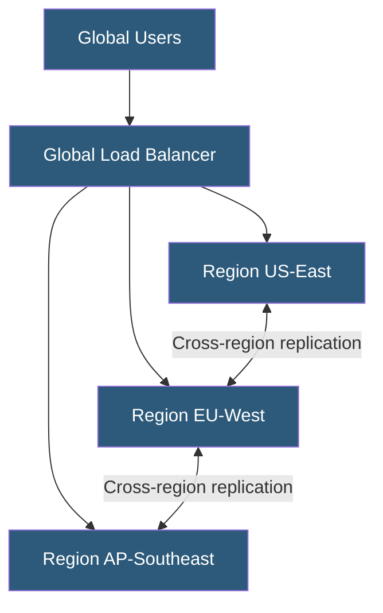

**Category:** High Availability Design
**Difficulty:** Advanced
**Reading time:** 7 min read

---

Multi-region deployment distributes application infrastructure across cloud provider regions to achieve geographic redundancy, low-latency access for global users, and regulatory compliance with data residency requirements. It combines cloud-native services with architectural patterns to ensure seamless cross-region operation.

- **Cloud region** — geographic cluster of cloud datacenters operated by a single provider
- **Region pair** — cloud provider-defined paired regions for disaster recovery (Azure) or closest proximity
- **Global load balancer** — routes user requests to the optimal region based on latency and health
- **Cross-region replication** — automated data synchronization across cloud regions
- **Latency-based routing** — directing users to the region that provides the fastest response
- **Failover region** — secondary region that accepts traffic when primary region is degraded
- **Traffic manager** — DNS-level service directing users to appropriate regional endpoints
- **Cold/warm/hot standby** — describes how quickly a failover region can accept traffic

Multi-region deployments on cloud platforms leverage provider-native tools to manage the complexity of distributed infrastructure. AWS uses Route 53 Traffic Flow with latency-based or geoproximity routing policies to direct users to the nearest healthy region. Azure Traffic Manager and Azure Front Door provide equivalent functionality, with Front Door adding CDN capabilities. GCP's Global HTTP(S) Load Balancer operates at the Anycast level, routing globally before traffic enters the regional network.

Each region contains a complete deployment of the application stack—compute, caching, and database tiers. Infrastructure-as-code tools (Terraform, CloudFormation) with region parameterization ensure identical configuration across regions, preventing configuration drift. Automated CI/CD pipelines deploy to multiple regions in sequence or in parallel, using canary deployments to validate each region before proceeding.

Database replication between regions is handled through provider-native services: Amazon Aurora Global Database achieves under 1-second replication lag across regions. Azure Cosmos DB offers multi-region writes with configurable consistency levels. For self-managed databases, tools like Percona XtraDB Cluster or PostgreSQL logical replication manage cross-region data synchronization.

Stateful services require special handling in multi-region setups. Session data stored in Redis must either be replicated (Redis Enterprise Global Geo-Distribution) or users must be affinity-pinned to a specific region. Object storage (S3, Azure Blob) supports cross-region replication natively, ensuring assets and uploads are available regardless of which region serves a request.

- SaaS applications with global customer bases requiring low latency
- E-commerce platforms active in multiple regulatory jurisdictions
- Applications with data residency requirements in EU, APAC, and Americas
- Systems requiring aggressive RPO/RTO through active-active global deployment
- Media platforms delivering content to users worldwide

| Advantage | Disadvantage |
|-----------|--------------|
| Low latency for globally distributed users | Significantly higher cost than single-region |
| Automatic failover between regions | Complex data consistency management |
| Meets multi-jurisdiction data residency rules | Requires sophisticated deployment automation |
| Scales horizontally across regions | Cross-region data transfer costs add up |

- [Geographic Redundancy](geographic-redundancy.md)
- [Availability Zones](availability-zones.md)
- [Database Replication for HA](database-replication-for-ha.md)

---
*Part of the [High Availability Design](index.md) category · [Back to Master Index](../../index.md)*
