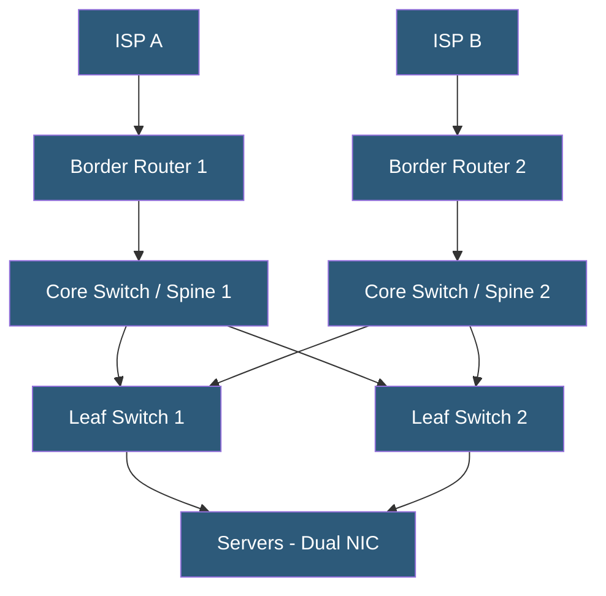

**Category:** High Availability Design
**Difficulty:** Intermediate
**Reading time:** 6 min read

---

Network redundancy design eliminates network infrastructure as a source of service unavailability by deploying multiple independent paths, devices, and upstream providers. It spans physical layer cabling through logical routing protocols to ensure that no single cable cut, switch failure, or ISP outage can isolate a system.

- **Spine-leaf architecture** — two-tier network topology where every leaf connects to every spine for path redundancy
- **LACP (Link Aggregation Control Protocol)** — bonds multiple physical links into a single logical interface
- **MLAG (Multi-chassis Link Aggregation Group)** — link aggregation spanning two physical switches
- **BGP multihoming** — connecting to two or more upstream ISPs with BGP for path redundancy
- **ECMP (Equal-Cost Multi-Path)** — routing traffic across multiple equal-cost paths simultaneously
- **BFD (Bidirectional Forwarding Detection)** — fast failure detection for routing protocol adjacencies
- **Diverse physical routing** — running cables through different conduits, risers, and manholes
- **Out-of-band management** — separate management network for device access when production network fails

Physical layer redundancy starts with dual-homed servers: each server has at least two network interface cards (NICs) connected to different switches. Linux bonding or LACP combines these into a single logical interface that survives a single NIC or uplink failure. MLAG extends this across two physical switches, so a full switch failure does not disconnect servers.

The access layer connects to distribution and core switches using spine-leaf architecture. In a spine-leaf fabric, every leaf switch connects to every spine switch. This provides any-to-any connectivity with predictable latency and means any single spine failure is absorbed without traffic loss—remaining spines carry the load via ECMP.

BGP multihoming provides ISP redundancy. An organization obtains its own ASN and IP address block (Provider-Independent IP space), then announces these prefixes to two or more ISPs via BGP sessions. BGP local preference and AS path prepending control which ISP carries outbound traffic. If one ISP fails, BGP withdraws routes from that peer and all traffic flows through the surviving ISP. Convergence typically takes 60–180 seconds with vanilla BGP, tunable to under 5 seconds with BFD and aggressive timers.

Physical diversity prevents correlated failures from cable cuts. Uplinks enter the building through different conduit paths and diverse geographic entry points. Within the datacenter, cables run in separate trays on opposite sides of aisles. Underground diverse paths to different carrier hotels ensure that street construction or a fiber cut does not simultaneously affect both ISP connections.

- Datacenter networks requiring 99.99%+ uptime for hosted services
- Campus networks where switch failures must not affect production systems
- Internet-facing infrastructure with multi-ISP connectivity for link redundancy
- Financial trading platforms with sub-second failover requirements
- Colocation tenants building resilient infrastructure in shared facilities

| Advantage | Disadvantage |
|-----------|--------------|
| Eliminates network as single point of failure | Doubles switch and cabling costs |
| ECMP distributes load across all available paths | Dual ISP requires own ASN and PI address space |
| BFD enables sub-second failure detection | Spine-leaf requires more switching hardware than 3-tier |
| Physical diversity protects against cable cuts | Maintaining diverse cable paths requires ongoing coordination |

- [Load Balancer Redundancy](load-balancer-redundancy.md)
- [Power Redundancy Configurations](power-redundancy-configurations.md)
- [Single Point of Failure Elimination](single-point-of-failure-elimination.md)

---
*Part of the [High Availability Design](index.md) category · [Back to Master Index](../../index.md)*
