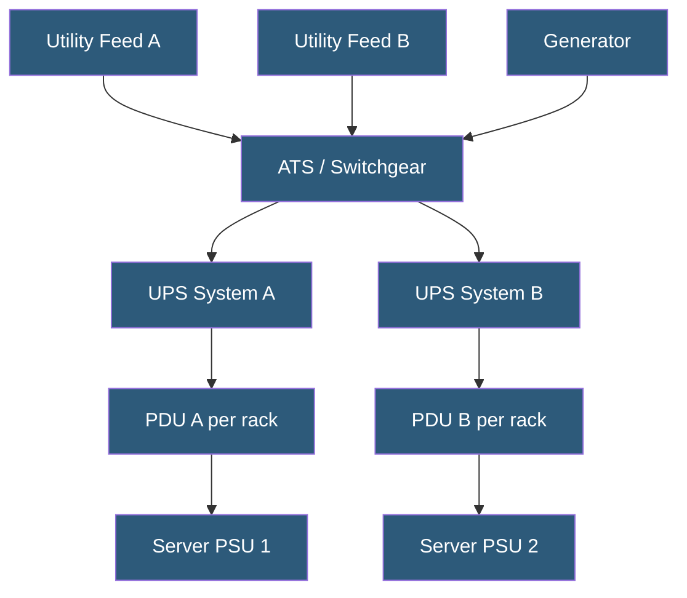

**Category:** High Availability Design
**Difficulty:** Intermediate
**Reading time:** 6 min read

---

Power redundancy configurations protect against power failures at every level—from utility feeds to the server PSU—using redundant utility connections, UPS systems, generators, and dual-corded server equipment. Datacenter Tier classifications (I–IV) formalize these redundancy levels against standardized specifications.

- **Tier I–IV** — Uptime Institute datacenter classifications; Tier IV provides fully redundant power with 99.995% availability
- **Dual-corded server** — server with two power supply units connected to separate power circuits
- **UPS (Uninterruptible Power Supply)** — battery backup providing conditioned power during utility switchover
- **ATS (Automatic Transfer Switch)** — automatically switches between primary and backup power sources
- **PDU (Power Distribution Unit)** — distributes power from building circuits to racks; redundant PDUs per rack
- **Static transfer switch (STS)** — transfers between power sources in under 4 ms, within equipment tolerance
- **Generator** — diesel or natural gas generator providing long-term backup when utility power fails
- **2N power** — fully redundant power path; two complete independent power distribution systems

Enterprise datacenters receive power from two independent utility substations via separate physical cable paths. An automatic transfer switch (ATS) monitors both feeds and switches to the backup in under 100 milliseconds. UPS systems (typically valve-regulated lead-acid or lithium-ion batteries) bridge the gap between utility failure and generator startup—generators require 10–20 seconds to reach operating speed and assume load.

UPS systems are deployed in N+1 or 2N configurations. In a 2N UPS deployment, two completely independent UPS systems each serve separate power distribution paths (A and B sides). Every rack receives one PDU from the A side and one from the B side. Servers with redundant PSUs connect one PSU to each PDU. If an entire UPS system fails, all servers continue operating on the surviving path.

Generators sized to carry 100% of facility load provide runtime limited only by diesel fuel supply. Enterprise datacenters maintain 24–72 hours of on-site fuel with fuel delivery contracts. Generator testing includes weekly no-load runs and quarterly or annual full-load transfers.

The Uptime Institute Tier standard defines four levels: Tier I (N redundancy, single distribution path, 99.671% availability), Tier II (N+1 redundancy), Tier III (concurrent maintainability—all components maintainable without downtime), and Tier IV (fault tolerant—2N+1 redundancy, 99.995% availability, 26.3 minutes downtime per year maximum).

- Tier III/IV datacenter design for mission-critical hosting
- Server room upgrades adding redundant PDUs and dual-corded equipment
- Edge computing locations requiring generator backup for remote sites
- Healthcare and financial facilities with regulatory uptime requirements
- Colocation deployments where tenants specify dual-corded server requirements

| Advantage | Disadvantage |
|-----------|--------------|
| 2N power eliminates power as SPOF for all equipment | Doubles power infrastructure investment |
| UPS provides clean conditioned power throughout | UPS batteries require regular testing and replacement |
| Generator enables multi-day operation without utility power | Generator maintenance, fuel management, and noise compliance |
| Tier IV certification demonstrates provable fault tolerance | Tier IV construction costs significantly exceed Tier III |

- [Redundancy Strategies](redundancy-strategies.md)
- [Network Redundancy Design](network-redundancy-design.md)
- [High Availability Architecture Principles](high-availability-architecture-principles.md)

---
*Part of the [High Availability Design](index.md) category · [Back to Master Index](../../index.md)*
