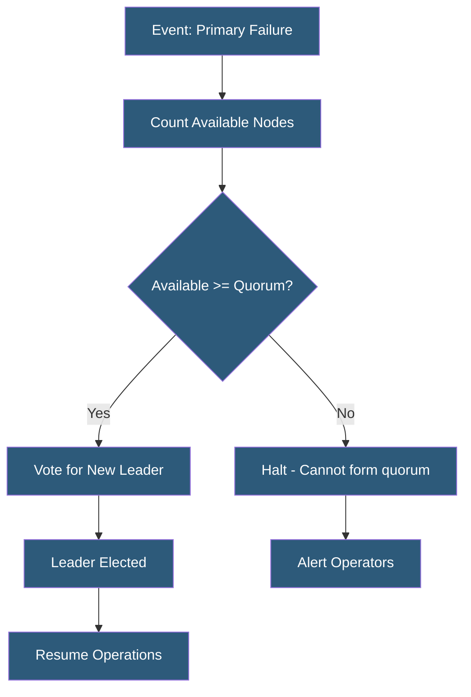

**Category:** High Availability Design
**Difficulty:** Advanced
**Reading time:** 6 min read

---

Quorum-based systems require a majority of nodes to agree before executing critical operations like leader election or committing writes. This mathematical approach to distributed consensus prevents split-brain scenarios and ensures that cluster operations can only proceed when enough healthy nodes are present to form a reliable majority.

- **Quorum** — minimum number of nodes required to agree before a cluster action proceeds
- **Majority quorum** — requires (N/2)+1 nodes; most common formulation
- **Write quorum** — minimum nodes that must confirm a write before it is considered durable
- **Read quorum** — minimum nodes that must respond to a read to guarantee fresh data
- **Dynamic quorum** — quorum size adjusts as nodes join or leave the cluster
- **Witness node** — lightweight node participating only in voting, not data storage
- **Epoch** — monotonically increasing term number preventing stale leaders from regaining authority
- **Quorum loss** — condition where fewer than quorum nodes are available; cluster halts to prevent inconsistency

Quorum is a mathematical mechanism derived from voting theory. For a cluster of N nodes, a majority quorum requires floor(N/2)+1 votes. For 3 nodes, quorum is 2; for 5 nodes, quorum is 3. This guarantees that any two quorums share at least one node in common—preventing two separate groups from independently making conflicting decisions.

In practice, quorum applies to leader election (only one node can be elected leader, as it requires majority agreement), write acknowledgment (a write is only durable when a quorum of nodes have confirmed receipt), and cluster membership changes (nodes can only join or leave when a quorum approves the change).

etcd implements quorum using the Raft consensus algorithm. Every write to etcd must be committed by a majority of etcd nodes before being considered durable. This makes etcd highly suitable as a coordination store for HA systems—its consistency guarantees mean that distributed locks and leader election flags stored in etcd are reliable even during node failures.

Two-node clusters present a special challenge: neither node can independently form a quorum (1 out of 2 is 50%, not a majority). Solutions include adding a third node, deploying a lightweight quorum witness (a minimal-resource node that participates in voting but holds no data), or using a cloud-based arbitration service. Windows Server Failover Clustering supports a cloud witness stored in Azure Blob Storage.

Quorum systems make a deliberate trade-off: they prioritize consistency over availability. When quorum cannot be formed, the cluster stops accepting writes rather than risking inconsistency. This is appropriate for financial and database workloads but may be unsuitable for systems that must continue operating in degraded mode.

- etcd clusters in Kubernetes control planes requiring majority agreement
- PostgreSQL Patroni HA using etcd quorum for leader election
- Elasticsearch cluster state management requiring master quorum
- Windows Server Failover Clustering with quorum witness
- Distributed databases (CockroachDB, Cassandra) for write consistency

| Advantage | Disadvantage |
|-----------|--------------|
| Mathematically prevents split-brain scenarios | Quorum loss causes cluster to halt writes |
| Works correctly even with partial network partitions | Odd-numbered clusters required for clean majority |
| Proven correctness properties via formal verification | Two-node clusters require workarounds |
| Scales to large clusters with predictable behavior | Adds latency proportional to quorum round trips |

- [Split-Brain Prevention](split-brain-prevention.md)
- [Consensus Algorithms (Raft, Paxos)](consensus-algorithms-raft-paxos.md)
- [Leader Election Mechanisms](leader-election-mechanisms.md)

---
*Part of the [High Availability Design](index.md) category · [Back to Master Index](../../index.md)*
