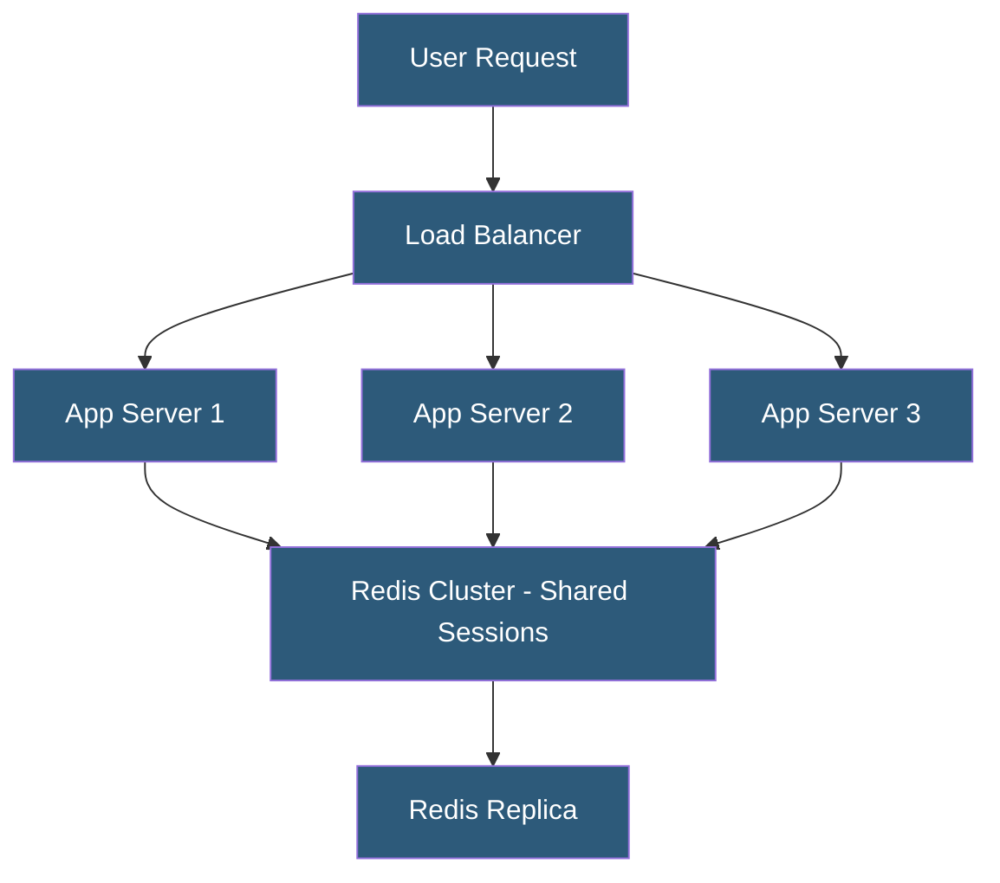

**Category:** High Availability Design
**Difficulty:** Intermediate
**Reading time:** 6 min read

---

Session state management in high availability environments ensures that user sessions are not lost when requests are routed to different application instances or when a server fails. Centralized session stores, client-side tokens, and stateless design patterns each address this challenge with different trade-offs.

- **Session affinity (sticky sessions)** — routing all requests from a user to the same server instance
- **Centralized session store** — external database (Redis, Memcached) holding all session data
- **JWT (JSON Web Token)** — cryptographically signed token carrying session claims in the request itself
- **Stateless application** — application that holds no user-specific state between requests
- **Session replication** — copying session state across multiple application server nodes
- **Session serialization** — converting in-memory session objects to a storable format
- **Session TTL** — expiration time after which inactive sessions are deleted
- **Read-through cache** — session store that automatically populates from backing store on cache miss

Traditional applications store session data in server memory, meaning requests must always return to the same server (sticky sessions). This creates problems in HA environments: server failures orphan sessions, and load balancers cannot freely redistribute traffic. Three architectures solve this at different levels of the stack.

The centralized session store pattern moves session data from server memory to an external store like Redis or Memcached. Every application server reads and writes session data to the shared store using the session ID from the client cookie. Any server can handle any request because all servers access the same session data. Redis provides persistence and replication for session durability; if the application server fails, the next server that handles the user's request simply reads their session from Redis. PHP's session.save_handler, Spring Session, and ASP.NET's distributed session provider all support Redis as a session backend.

JWT-based authentication eliminates server-side session storage entirely. The server issues a cryptographically signed token (using HMAC-SHA256 or RSA) containing user claims, expiration time, and optionally permissions. The client includes this token in every request. Any server can verify the token signature without querying a session store. This is the most horizontally scalable approach but requires careful token rotation and revocation strategy (revoking a valid JWT before expiry requires a token blacklist, which partially reintroduces a shared store).

Session replication (used by Java EE application servers like WildFly, Tomcat clustering) copies session objects between all cluster members. This eliminates the external dependency but increases network traffic proportional to session size and cluster size.

- E-commerce platforms using Redis for persistent shopping cart sessions
- Microservices architectures using JWTs for stateless authentication
- PHP applications using centralized Redis session handler
- Java application clusters using Hazelcast for session replication
- API gateways validating JWTs without hitting a session database

| Advantage | Disadvantage |
|-----------|--------------|
| Centralized store enables any server to handle any request | Redis becomes a critical dependency requiring its own HA |
| JWTs eliminate session store dependency entirely | JWT revocation before expiry requires additional infrastructure |
| Session replication survives store failure | Replication traffic scales poorly with large sessions |
| Stateless design simplifies horizontal scaling | Stateless design requires moving all state to client or DB |

- [Sticky Session Alternatives](sticky-session-alternatives.md)
- [Stateless Application Design](stateless-application-design.md)
- [High Availability Architecture Principles](high-availability-architecture-principles.md)

---
*Part of the [High Availability Design](index.md) category · [Back to Master Index](../../index.md)*
