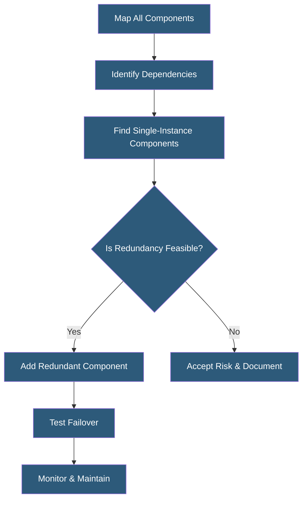

**Category:** High Availability Design
**Difficulty:** Intermediate
**Reading time:** 5 min read

---

A single point of failure (SPOF) is any component whose failure causes total service unavailability. Systematically identifying and eliminating SPOFs is the foundational practice of high availability design, requiring both architectural analysis and redundant component deployment.

- **SPOF analysis** — systematic identification of components that can alone cause failure
- **Failure mode analysis** — understanding how each component fails and the downstream impact
- **Redundancy elimination** — replacing single components with redundant pairs or clusters
- **Dependency mapping** — charting all component relationships to surface hidden SPOFs
- **Hardware SPOF** — physical component (NIC, disk, PSU) that lacks redundancy
- **Software SPOF** — single process or service instance with no replica
- **Network SPOF** — single upstream provider, switch, or cable path
- **Human SPOF** — single person with exclusive knowledge or access

SPOF elimination begins with a comprehensive dependency map of the entire system. Every component—servers, network devices, storage systems, power paths, software services, and third-party APIs—is catalogued. Dependencies between components are charted to show which failures cascade into others. This often reveals hidden SPOFs in components that appear redundant but share a common dependency, such as two servers connected to the same unredundant switch.

Once SPOFs are identified, each is assessed for its blast radius (how much service it impacts) and its likelihood of failure. High-impact, high-probability SPOFs are prioritized for elimination first. Common hardware SPOFs addressed include single power supplies (replaced with dual PSUs on separate circuits), single NICs (replaced with bonded/teamed interfaces), and single disks (replaced with RAID arrays).

At the network layer, SPOF elimination involves dual upstream ISPs, redundant switches using HSRP or VRRP for gateway redundancy, and diverse physical cable paths. At the application layer, single-instance services are converted to clustered deployments with load balancing. Databases move from standalone instances to replicated clusters with automatic primary election.

Some SPOFs cannot be eliminated economically—a single hyperscale internet exchange, for example. These residual risks must be documented, their impact quantified, and compensating controls applied such as SLA-backed provider agreements or manual failover runbooks.

- Pre-deployment architecture review for new production systems
- Post-incident root cause analysis when an SPOF caused an outage
- Data center infrastructure audits
- Compliance assessments requiring documented HA controls
- Cloud migration planning to eliminate on-premises SPOFs

| Advantage | Disadvantage |
|-----------|--------------|
| Directly improves service availability | Increased infrastructure and licensing cost |
| Provides clear documentation of residual risk | Audit process is time-consuming |
| Enables proactive maintenance windows | Some SPOFs are prohibitively expensive to eliminate |
| Reduces emergency incident frequency | Added redundancy introduces new failure modes to manage |

- [Redundancy Strategies](redundancy-strategies.md)
- [High Availability Architecture Principles](high-availability-architecture-principles.md)
- [HA Testing Procedures](ha-testing-procedures.md)

---
*Part of the [High Availability Design](index.md) category · [Back to Master Index](../../index.md)*
