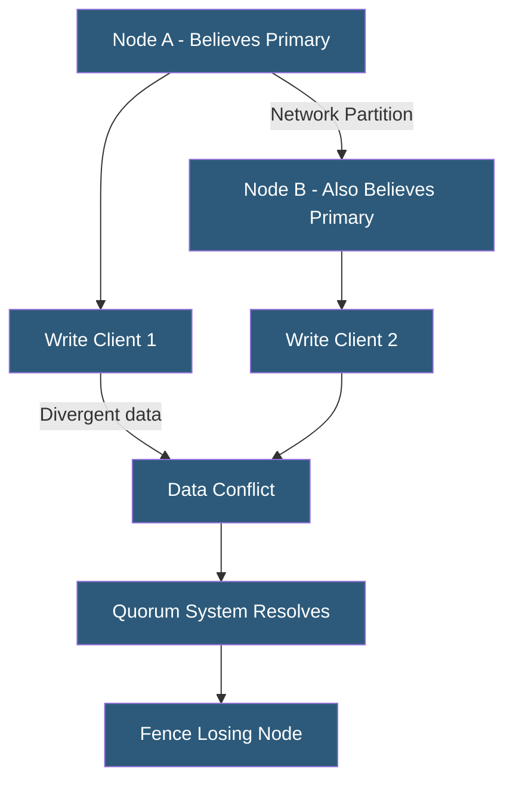

**Category:** High Availability Design
**Difficulty:** Advanced
**Reading time:** 7 min read

---

Split-brain occurs when network partitioning causes multiple cluster nodes to simultaneously believe they are the authoritative primary, leading to divergent writes, data corruption, and inconsistent system state. Prevention strategies include quorum systems, STONITH fencing, and witness nodes that ensure only one node can act as primary at any time.

- **Split-brain** — condition where two or more nodes independently assume the primary role
- **Network partition** — break in communication between cluster nodes that does not indicate node failure
- **STONITH** — fencing mechanism that physically isolates a suspect node before it can cause data corruption
- **Quorum node** — lightweight tiebreaker node that participates in leader election without holding data
- **Witness server** — external node used to establish quorum in even-numbered clusters
- **Fence domain** — set of nodes that can be isolated by a fencing device
- **WAL divergence** — PostgreSQL scenario where two nodes have accepted different transactions after a split
- **DCS (Distributed Configuration Store)** — etcd, Consul, or Zookeeper used as authoritative quorum source

Split-brain prevention relies on the principle that a node should only assume the primary role if it can confirm that no other node is also operating as primary. In small clusters, this is done through quorum: a node must receive votes from a majority of cluster members before promoting itself. A two-node cluster is inherently vulnerable—each node constitutes 50% of votes, so neither has a majority when communication breaks. Adding a third node (or a quorum witness) ensures a majority is always achievable by exactly one partition.

Fencing (STONITH) is the practical implementation mechanism. Before a standby node promotes itself, it must successfully fence the primary—either by powering it off via IPMI/iDRAC, disabling its network ports via a managed switch API, or revoking its shared storage access via a SCSI reservation. If fencing fails, promotion must be blocked: the risk of split-brain data corruption outweighs the availability loss of staying down.

Distributed configuration stores like etcd provide a higher-level abstraction. Patroni requires each PostgreSQL node to hold a distributed lock in etcd before accepting writes. If a primary loses connectivity to etcd, it voluntarily demotes itself rather than risking split-brain. etcd itself uses the Raft consensus algorithm to maintain a consistent view across its own nodes.

Database-level protections include PostgreSQL's `recovery_min_apply_delay` and primary promotion safeguards, MySQL Group Replication's paxos-based single-primary mode, and MongoDB's replica set election protocol which requires a majority of voting members to elect a primary.

- PostgreSQL HA clusters using Patroni with etcd fencing
- Linux Pacemaker/Corosync clusters with IPMI fencing
- MySQL Group Replication preventing dual-primary scenarios
- Kubernetes control plane etcd clusters preventing split control plane
- Storage cluster controllers preventing simultaneous write ownership

| Advantage | Disadvantage |
|-----------|--------------|
| Prevents catastrophic data corruption | Fencing failure blocks recovery entirely |
| Quorum ensures only one authoritative primary | Odd-number node requirements add infrastructure cost |
| DCS provides reliable distributed lock service | DCS is itself a component that requires HA |
| Automated fencing eliminates human decision under stress | Fencing delay adds time to recovery |

- [Quorum-Based Systems](quorum-based-systems.md)
- [Failover Automation](failover-automation.md)
- [Consensus Algorithms (Raft, Paxos)](consensus-algorithms-raft-paxos.md)

---
*Part of the [High Availability Design](index.md) category · [Back to Master Index](../../index.md)*
