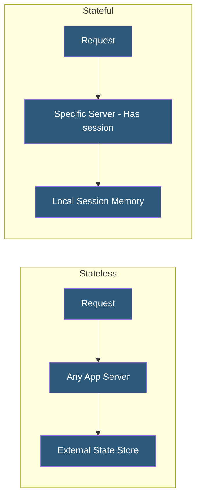

**Category:** High Availability Design
**Difficulty:** Intermediate
**Reading time:** 6 min read

---

Stateless application design ensures that each request contains all information needed to process it, with no server-side state persisted between requests. This enables any server instance to handle any request, making horizontal scaling trivial and eliminating server-specific failure modes.

- **Stateless** — server holds no client-specific data between requests; all state in request or external store
- **Stateful** — server maintains session-specific data (memory, local files) between requests
- **Twelve-Factor App** — methodology defining stateless, horizontally scalable application architecture
- **Idempotency** — same request produces same result regardless of how many times it is executed
- **External state store** — databases, caches, and object storage where persistent state lives
- **Immutable infrastructure** — servers are replaced rather than modified; ephemeral by design
- **Horizontal scaling** — adding more identical instances behind a load balancer
- **Ephemeral storage** — local disk storage that is lost when a server restarts or is replaced

Stateless application design is one of the Twelve-Factor App principles, formalized to describe cloud-native application architecture. The core requirement is that no in-process state persists between requests. Any data that must persist goes to external stores: user session data to Redis, uploaded files to object storage (S3), database records to a relational or document database, and task queues to a message broker.

The practical benefits emerge during scaling and failure events. When demand increases, new identical instances can be added behind the load balancer without any warm-up period or state migration—each new instance is fully functional immediately. When an instance fails, the load balancer removes it and remaining instances continue handling all traffic without any state loss, because no state existed on the failed instance.

Converting a stateful application to stateless requires auditing all state locations. Local file writes must move to object storage. In-memory caches that are populated by one request and read by the next must move to Redis. Scheduled tasks that rely on local cron state must move to distributed job queues (Celery, Sidekiq, BullMQ). Session data must move to a shared session store or become client-side tokens.

Idempotency is a companion principle: if a request is retried (due to network failure or load balancer retry), it should produce the same result as if it were executed once. Implementing idempotency keys for payment and mutation endpoints prevents duplicate operations when clients retry failed requests.

- Kubernetes-deployed microservices designed for horizontal pod autoscaling
- Serverless functions (Lambda, Cloud Functions) that are inherently stateless
- API services using JWTs for authentication without server-side sessions
- Container workloads where ephemeral storage is discarded on instance replacement
- Blue/green deployment targets where instances are frequently replaced

| Advantage | Disadvantage |
|-----------|--------------|
| Free horizontal scaling—add instances without migration | All state requires external infrastructure (Redis, S3, DB) |
| Any instance handles any request—no sticky routing | External state stores introduce network latency per request |
| Instance failures cause zero state loss | Converting stateful legacy apps requires significant refactoring |
| Simplifies deployment—instances are interchangeable | External store failures affect all instances simultaneously |

- [Session State Management in HA](session-state-management-in-ha.md)
- [Sticky Session Alternatives](sticky-session-alternatives.md)
- [Zero-Downtime Deployments](zero-downtime-deployments.md)

---
*Part of the [High Availability Design](index.md) category · [Back to Master Index](../../index.md)*
