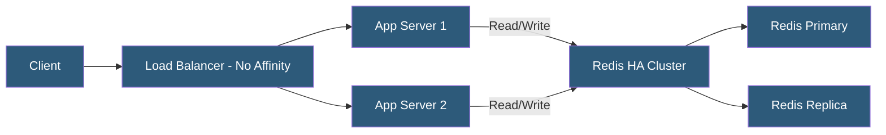

**Category:** High Availability Design
**Difficulty:** Intermediate
**Reading time:** 5 min read

---

Sticky sessions (session affinity) improve HA by pinning users to specific servers, but they create uneven load distribution and complicate failover. Modern alternatives—including centralized caches, JWT tokens, and stateless design—eliminate the need for session affinity while preserving session continuity across any server.

- **Session affinity** — load balancer routes the same client to the same backend using cookies or IP hashing
- **Shared session store** — external Redis or Memcached cluster accessible by all application servers
- **Stateless token** — client-side JWT containing session claims; no server-side storage needed
- **Database-backed sessions** — sessions persisted in a relational database; slower but durable
- **Application-level routing** — request routing based on user ID or tenant rather than session stickiness
- **CQRS** — Command Query Responsibility Segregation; separates read and write paths, simplifying state management
- **Eventual consistency** — session data may lag slightly across nodes; acceptable for many use cases
- **Cache invalidation** — removing or updating stale session entries from the shared store

Sticky sessions use the load balancer to insert a cookie (e.g., AWSALB, SERVERID) that identifies the target backend. On subsequent requests, the load balancer reads the cookie and routes to the same server. While simple to implement, this degrades HA because a server failure drops all sessions pinned to it, and the load balancer cannot rebalance traffic freely.

The primary alternative is a shared session store. Redis is the dominant choice due to its in-memory speed (sub-millisecond reads), native data structure support (hashes for session objects), TTL-based expiration for automatic session cleanup, and robust cluster and replication support. The application's session handler is configured to use Redis instead of local memory. Any server can now handle any request by reading the session from Redis using the session ID cookie.

JWT-based sessions move state to the client. The server issues a signed token containing user identity, roles, and expiration. The client sends this token in the Authorization header on every request. Servers verify the signature cryptographically—no network call to a session store required. This improves scalability but complicates revocation: revoking a token before expiry requires maintaining a distributed blocklist, partially recreating the session store.

For applications already using a relational database, database-backed sessions (PHP's PDO session handler, Django's database session backend) are a simple approach. Sessions are stored in a sessions table and read on each request. This eliminates the Redis dependency at the cost of increased database load.

- PHP applications replacing file-based sessions with Redis
- Node.js Express apps using express-session with Redis store
- Spring Boot apps using Spring Session with Redis
- Microservices using JWTs for cross-service authentication
- Migrating from sticky sessions during horizontal scaling exercises

| Advantage | Disadvantage |
|-----------|--------------|
| Any server can handle any request; free load balancing | Redis cluster adds infrastructure and operational overhead |
| Server failures don't orphan sessions | JWT revocation requires blocklist for early expiry |
| Even traffic distribution improves resource utilization | Database-backed sessions add query load per request |
| Simplifies blue/green and canary deployments | Serialization overhead for complex session objects |

- [Session State Management in HA](session-state-management-in-ha.md)
- [Stateless Application Design](stateless-application-design.md)
- [Load Balancer Redundancy](load-balancer-redundancy.md)

---
*Part of the [High Availability Design](index.md) category · [Back to Master Index](../../index.md)*
