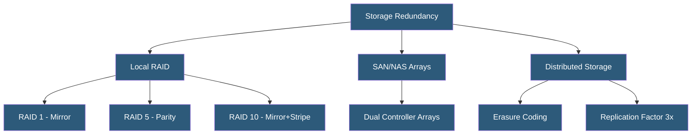

**Category:** High Availability Design
**Difficulty:** Intermediate
**Reading time:** 6 min read

---

Storage redundancy protects data against hardware failures through mechanisms ranging from local RAID arrays to distributed erasure-coded storage systems. Selecting the appropriate redundancy level requires balancing durability requirements, performance needs, and storage efficiency.

- **RAID (Redundant Array of Independent Disks)** — combines multiple disks to provide redundancy and/or performance
- **RAID 1** — mirroring; two identical copies on separate disks
- **RAID 5** — striping with distributed parity; tolerates one disk failure; minimum 3 disks
- **RAID 6** — dual parity; tolerates two simultaneous disk failures; minimum 4 disks
- **RAID 10** — mirrored stripes; high performance and redundancy; requires even number of disks
- **Erasure coding** — mathematical encoding that distributes data and parity across multiple nodes
- **Replication factor** — number of copies maintained in a distributed storage system
- **Durability** — probability of data survival over time (e.g., 99.999999999% for S3)

RAID operates at the block device level, transparent to the operating system and applications. RAID 1 (mirroring) writes identical data to two or more disks simultaneously. Reads can be served from either disk, improving read throughput. Usable capacity is 50% of raw capacity. RAID 1 is common for OS drives and boot volumes requiring fast recovery.

RAID 5 distributes data and a parity block across three or more disks. Any single disk failure can be recovered by reconstructing missing data from the remaining disks and parity. Storage efficiency is (N-1)/N—a four-disk RAID 5 array uses 75% of raw capacity. The rebuild process under load can take hours for large disks and temporarily reduces performance and redundancy. RAID 6 adds a second parity block, enabling survival of two simultaneous disk failures at the cost of additional overhead.

Enterprise SAN (Storage Area Network) and NAS arrays extend redundancy beyond RAID with dual storage controllers in active-active or active-passive configurations, redundant power supplies, redundant fabric connections, and cache mirroring between controllers. This eliminates the array itself as a SPOF.

Distributed storage systems (Ceph, HDFS, GlusterFS) and cloud object storage (S3, Azure Blob) use erasure coding to distribute data across many nodes. S3's 11-nines durability is achieved through erasure-coded replication across multiple facilities. Ceph can be configured for erasure coding (more storage-efficient) or triple replication (simpler recovery). The replication factor of 3 means three copies exist on different nodes, tolerating two simultaneous node failures.

- Database servers using RAID 10 for high IOPS with redundancy
- NAS appliances using RAID 6 for bulk storage with dual-disk failure protection
- Cloud-native applications leveraging object storage with built-in erasure coding
- Hyperconverged infrastructure using distributed storage with replication
- Backup systems using RAID 5 or 6 for cost-effective secondary storage

| Advantage | Disadvantage |
|-----------|--------------|
| RAID 10 provides best read/write performance | RAID 10 uses only 50% of raw capacity |
| Erasure coding achieves near-disk-level efficiency | Erasure coded recovery is CPU-intensive |
| Triple replication enables fast recovery | 3x replication uses 3x storage capacity |
| Enterprise arrays provide comprehensive controller redundancy | SAN/NAS arrays are expensive single-vendor solutions |

- [Redundancy Strategies](redundancy-strategies.md)
- [High Availability Architecture Principles](high-availability-architecture-principles.md)
- [Power Redundancy Configurations](power-redundancy-configurations.md)

---
*Part of the [High Availability Design](index.md) category · [Back to Master Index](../../index.md)*
