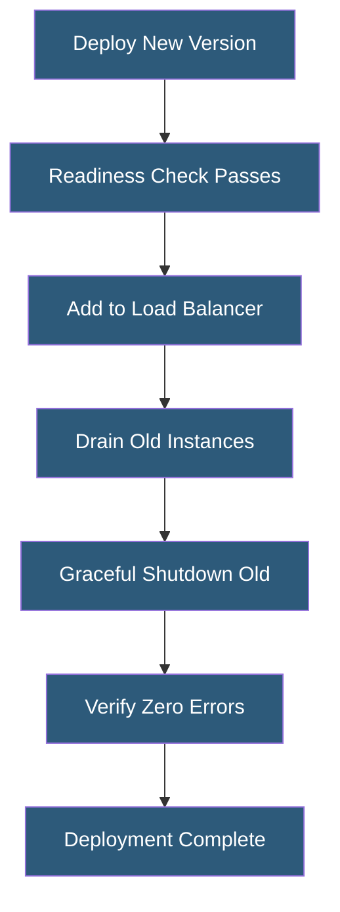

**Category:** High Availability Design
**Difficulty:** Intermediate
**Reading time:** 6 min read

---

Zero-downtime deployments update running systems without interrupting service availability. They combine application-level readiness signaling, database migration strategies, and traffic management techniques to deliver new code and configuration changes while maintaining continuous request processing.

- **Zero-downtime deployment** — code deployment where no requests fail or experience elevated error rates
- **Graceful shutdown** — process termination that completes in-flight requests before exiting
- **Readiness gate** — condition that must be true before a new instance receives production traffic
- **Database forward compatibility** — schema changes that work with both old and new application code
- **Expand-contract migration** — two-phase schema migration that avoids breaking running code
- **Feature flag** — runtime toggle enabling or disabling features without redeployment
- **Connection draining** — load balancer waits for existing connections to complete before deregistering a backend
- **PreStop hook** — Kubernetes hook that runs before a container receives SIGTERM

Zero-downtime deployments require coordination between the application, deployment system, and traffic management layer. The application must implement graceful shutdown: when it receives a SIGTERM, it stops accepting new requests, completes in-flight requests (with a timeout), and then exits. Without graceful shutdown, abrupt process termination drops active requests.

Database schema changes are a common source of deployment-related outages. The expand-contract pattern handles this safely. In the "expand" phase, backward-compatible changes are deployed (adding a new nullable column, creating a new table). Both old and new application versions run simultaneously during a rolling deployment, so schema changes must work with both. In the "contract" phase, after the old version is fully replaced, the no-longer-needed old schema elements are removed.

Kubernetes orchestrates zero-downtime deployments through a combination of rolling update strategy, readiness probes, preStop hooks, and terminationGracePeriodSeconds. A preStop hook runs a brief sleep, giving the load balancer (kube-proxy, ingress controller) time to remove the pod from endpoints before SIGTERM is sent. The readiness probe ensures new pods receive traffic only after the application is fully initialized.

Feature flags decouple deployment from feature release. New code is deployed with the feature disabled globally. Once the deployment is validated, the flag is toggled to enable the feature for users. This allows instant rollback of a feature without a code deployment.

- Kubernetes rolling deployments with readiness probes and graceful shutdown
- Blue/green deployments with traffic shifting at the load balancer
- Database migrations using expand-contract pattern on live databases
- API versioning enabling parallel v1 and v2 deployments
- Mobile app backend deployments requiring backward API compatibility

| Advantage | Disadvantage |
|-----------|--------------|
| No service interruption for users during deployments | Application must implement graceful shutdown correctly |
| Failed deployments can be rolled back immediately | Expand-contract migrations require multiple deployment phases |
| Enables frequent deployments without maintenance windows | Running mixed code versions simultaneously requires compatibility discipline |
| Reduces pressure on deployment timing | Feature flags add code complexity and testing surface area |

- [Planned Maintenance Strategies](planned-maintenance-strategies.md)
- [Stateless Application Design](stateless-application-design.md)
- [Graceful Degradation](graceful-degradation.md)

---
*Part of the [High Availability Design](index.md) category · [Back to Master Index](../../index.md)*
