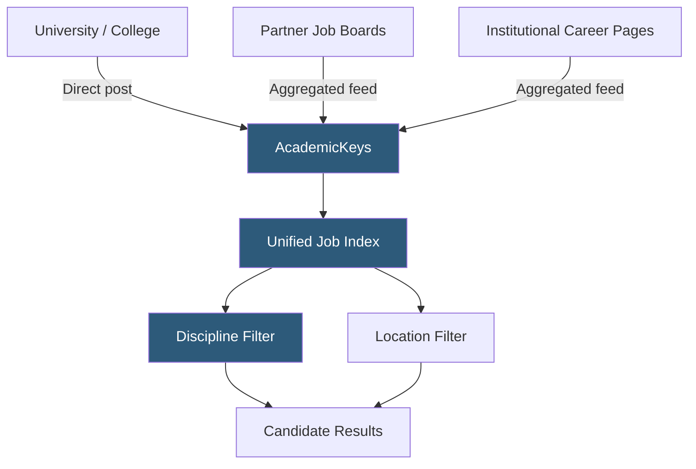

**Category:** Industry-Specific Job Boards
**Difficulty:** Beginner
**Reading time:** 5 min read

---

AcademicKeys is a higher education job board that aggregates faculty, staff, and administrative positions from universities and colleges, offering an alternative to HigherEdJobs and Chronicle Vitae with a simpler interface and broad coverage across academic disciplines.

- **Job Aggregation** — collecting listings from institutional career pages, partner boards, and direct postings into a unified searchable index
- **Discipline Category** — AcademicKeys' subject classification system organizing faculty listings by field of study
- **Institutional Direct Post** — universities posting directly to AcademicKeys rather than relying on aggregation
- **Faculty Position Types** — full professor, associate professor, assistant professor, lecturer, and instructor classifications
- **Academic Job Alert** — email notification service for new postings matching saved discipline and location criteria
- **Free Listing Tier** — AcademicKeys historically offered free or low-cost posting options for smaller institutions

AcademicKeys functions as a combination job board and aggregator for higher education. Institutions can post directly to the platform, but a significant portion of the listings are pulled from partner sources and institutional career pages, which means the index is often broader than what institutions have explicitly submitted. This aggregation model keeps costs low for employers while maximizing candidate reach.

The search interface is organized around discipline categories rather than requiring precise keyword searches, which suits academic job seekers who know their field but may not know exactly what job titles to search. Categories span liberal arts, sciences, engineering, health sciences, business, and social sciences. Candidates can set up email alerts by discipline and geography, receiving daily or weekly digests of new postings.

AcademicKeys has historically served as a supplementary platform for job seekers who want broader coverage beyond the two dominant platforms (HigherEdJobs and Chronicle Vitae). Because it captures aggregated listings, candidates sometimes find roles that were not explicitly posted to the major boards. The platform is particularly useful for candidates open to a wide geographic range and willing to cast a broad net across institutions. Administrative and staff positions are included, though the platform's primary identity is faculty search.

- Assistant professor candidate running parallel searches across all major academic job boards
- Lecturer searching for community college teaching positions across a multi-state region
- International academic researching U.S. faculty openings in engineering disciplines
- University HR using free posting tier to reach supplementary audience beyond primary board
- Staff professional in academic IT monitoring administrative opening alerts

| Advantage | Disadvantage |
|-----------|--------------|
| Broad aggregated coverage increases listing volume | Aggregated listings may be outdated or already filled |
| Simple discipline-based search suits academic users | Less brand recognition than Chronicle Vitae or HigherEdJobs |
| Low or free posting cost accessible to small colleges | Editorial and career resources are minimal |
| Good supplementary coverage for thorough searches | Interface and UX less polished than major competitors |

- [HigherEdJobs Academic Positions](higheredjobs-academic-positions.md)
- [Chronicle Vitae Faculty Jobs](chronicle-vitae-faculty-jobs.md)
- [SchoolSpring K-12 Education](schoolspring-k-12-education.md)

---
*Part of the [Industry-Specific Job Boards](index.md) category · [Back to Master Index](../../index.md)*
