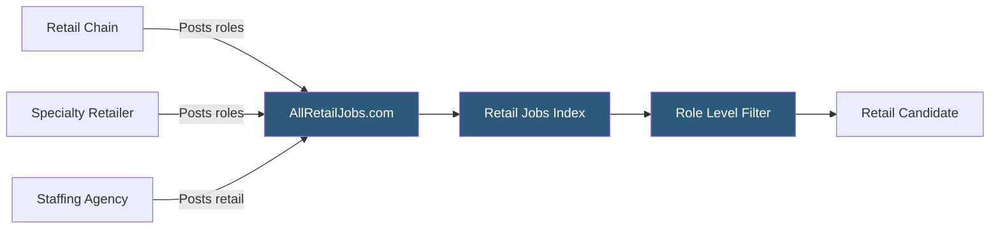

**Category:** Industry-Specific Job Boards
**Difficulty:** Beginner
**Reading time:** 5 min read

---

AllRetailJobs.com is a specialized job board for the retail industry, covering store associate, department manager, store manager, district manager, and corporate retail positions across specialty retail, department stores, grocery, and e-commerce operations.

- **Retail Store Associate** — front-line customer service and sales staff, the highest volume position in the retail sector
- **Store Manager** — the senior operational leader responsible for a single retail location's P&L, staffing, and customer experience
- **District Manager** — a regional leadership role overseeing multiple store managers and retail locations
- **Loss Prevention** — security and shrinkage-reduction roles specific to retail operations
- **Merchandising** — roles responsible for product placement, visual displays, and assortment planning
- **E-commerce / Omnichannel** — roles bridging physical and digital retail operations increasingly in demand

AllRetailJobs.com aggregates and hosts retail industry job listings from specialty chains, department stores, grocery retailers, and staffing agencies serving the retail sector. The platform covers the full retail employment hierarchy — from entry-level cashiers and sales associates through assistant managers and store managers to district, regional, and corporate retail positions.

The retail sector's hiring characteristics create distinct platform requirements. Hourly store associate hiring is extremely high-volume with rapid turnover, requiring fast application processes and high listing refresh rates. Management hiring is lower volume but higher stakes, with longer search processes and more detailed candidate evaluation. AllRetailJobs.com serves both markets on one platform, with role level filtering allowing candidates to focus on appropriate positions.

Geographic filtering is critical in retail hiring because store positions are inherently location-bound. Candidates search by city or metropolitan area, and employers post by specific store location. Corporate retail roles at headquarters (buying, planning, merchandising, e-commerce) are more geographically concentrated around major retail headquarters cities like New York, Columbus (Limited Brands), Seattle (Amazon), and Minneapolis (Target).

The platform competes with Indeed and Snagajob for hourly retail listings, where the generalist boards dominate by volume. AllRetailJobs.com differentiates through retail-specific filtering and its focus on management and corporate retail roles where specialization provides more value.

- National specialty retailer posting district manager openings across five regions simultaneously
- Grocery chain recruiting a category manager with private label development experience
- Retail professional searching for corporate merchandise planning roles at major chains
- Department store staffing seasonal associate positions across 20 locations before the holiday season
- Loss prevention director candidate searching for regional LP management roles

| Advantage | Disadvantage |
|-----------|--------------|
| Retail-specific filtering reduces irrelevant applications | Indeed and Snagajob dominate hourly retail listings by volume |
| Covers hourly through corporate in one platform | High turnover at hourly level means constant listing refresh needed |
| Good for management and corporate retail roles | Less effective for e-commerce roles that appear on tech boards |
| Staffing agency listings supplement direct employer postings | Brand recognition lower than generalist competitors |

- [RetailCrossing Retail Jobs](retailcrossing-retail-jobs.md)
- [Snagajob Hourly Worker Platform](snagajob-hourly-worker-platform.md)
- [Hospitality Online Hotel Jobs](hospitality-online-hotel-jobs.md)

---
*Part of the [Industry-Specific Job Boards](index.md) category · [Back to Master Index](../../index.md)*
